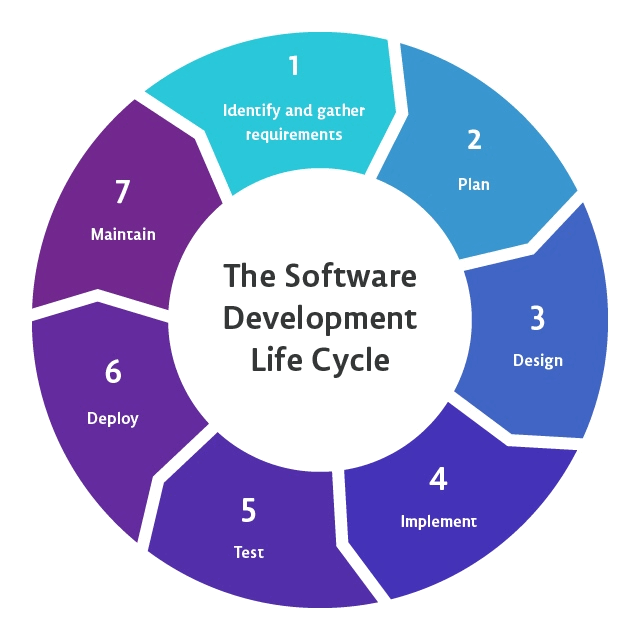

# Module - 1 Application_Development_SDLC

2026-08-05 15:47

Tags: #ADET 

Author:  Duke Hsu

---

## Topic 

1. Application Development Life Cycle
2. Types of Applications
3. Emerging Technology Trends
4. Modern Development Tools

### 1.0 Software Development Life Cycle 

 
#### Planning & Analysis

Planning  

1. Define project goals and scope  

2. Identify stakeholders and users  

3. Estimate time, cost and resources  

4. Create project timeline & risks  

5. Establish success metrics

Analysis  

1. Gather user requirements  

2. Document functional needs  

3. Analyze business processes  

4. Create use cases & user stories  

5. Identify system constraints  

6. Validate requirements with users

#### Design & Implementation

Design   

1. Create system architecture. 

2. Design database structure. 

3. Design user interface (UI/UX). 

4. Define data models & APIs. 

5. Create prototypes & wireframes. 

6. Select technology stack. 

Implementation(Coding)  

1. Write clean, modular code. 

2. Follow coding standards. 

3. Use version control(Git). 

4. Implement features iteratively. 

5. Conduct code reviews. 

6. Document the code  

#### Testing , Deployment & Maintenance

Testing   

1. Unit testing  

2. Integration testing  

3. System testing  

4. User Acceptance Testing (UAT)   

5. Bug fixing & regression.  

Deployment   

1. Release planning  

2. Environment setup  

3. Data migration  

4. Go-live activities  

5. User training

Maintenance  

1. Bug fixes & patches  

2. Performance monitoring  

3. Feature enhancements  

4. Security updates  

5. User support

### 2.0 Types of Applications

#### Desktop Applications

Software programs installed and run on a personal computer or workstation. They have full access to system resources and can work offline.

#### Web Applications

Applications accessed through a web browser over the internet. No installation required , uses can access them from any device with a browser. 

| Applications type    | Example                          | Advantages                                        | Disadvantages                                             | Technologies                                    |
| -------------------- | -------------------------------- | ------------------------------------------------- | --------------------------------------------------------- | ----------------------------------------------- |
| Desktop Applications | MS, PS, VS code, Obisidian etc.. | Fast, performance, offline, many features         | Platform dependent, manual updates, installation required | C++, Csharp,Java, Electron, .NET, Python,rust,  |
| Web Applications     | Gmail, FB,Netflix, ...etc        | Cross platform, easy updates, accessible anywhere | Internet required, browser limitations, security concerns | php,Node.js,JavaScript, html, css, react, mysql |

#### Mobile Applications

Applications designed specifically for smartphones and tablets. Can be native (iOS/Android), hybrid, or progressive web apps(PWA).  

1. Native Apps - Built for specific OS(Swift/Kotlin) , best performance  

2. Hybrid Apps - Cross  platform(React Native, Flutter) one codebase, run  many platform.  

3. PWA - Web apps that behave like native apps offline  

4. Examples - INS, Grab, GCash, Tiktok, LALAMOVE, etc

#### Cloud Applications

Applications hosted on cloud infrastructure(AWS, Azure, GCP), Users access them via internet. Highly scalable and accessible from anywhere  

1. SaaS - Software as a Service , ready to use apps (Office 365, salesforce)   

2. Advantages - Scalable, cost-effective, automatic updates, high availability  

3. Examples - Google Workspace, Dropbox, Slack, Zoom, Canva  

4. Key Benefit - Pay only for what you use , no expensive hardware needed.   

### 3.0 Emerging Technology Trends

Technologies shaping the future of application development

1. Artificial Intelligence  

2. Cloud Computing  

3. Internet of Things(IoT)  

4. Blockchain  

5. Low-Code / No-Code

#### Artificial Intelligence in Development 

1. Generation Code - GitHub Copilot, ChatGPT, and Claude can write  and suggest code  

2. Automated Testing  - AI tools detect bugs and generate test cases  automatically  

3. Digital content generation  

4. Natural Language - Voice assistants and NLP-powered interfa  

5. Predictive Analytics - Forecast user behavior and system per  

6. AI - Powered IDEs - Intelligent code completion and error detection

#### Cloud Computing Trends

1. Serverless Computing - Run code without managing servers  

2. Edge Computing - Process data closer to users for lover latency  

3. Cloud-Native Apps - Built specifically to take advantage of cloud capabilities  

4. Multi-Cloud Strategy - Use multiple cloud providers for flexibility ad risk reduction  

5. Containerization - Docker & Kubernetes for portable, scalable applications  

6. Cost Optimization - Auto scaling and pay-as-you-go models reduce expenses

#### Internet of Things (IoT)

IoT connects everyday devices to the internet, enabling them to collect and exchange data , this creates opportunities for smart applications in homes, cities, healthcare, and industry.  

1. Smart home  - Light, thermostats, security cameras  

2. Healthcare - Wearables, remote patient monitoring  

3. Agriculture - Soil sensors, automated irrigation  

4. Industry 4.0 - Predictive maintenance, smart factories

#### Blockchain Technology

A decentralized, immutable digital ledger that records transactions across many computers. Originally created for cryptocurrencies, it is now used for secure data sharing, supply chain, and digital identily. 

1. Decentralized - No single point of control of failure  

2. Immutable - once recorded, data cannot be changed  

3. Transparent - All participants can view the ledger  

4. Secure - Cryptography protects against fraud

#### Low -Code / No - Code Platforms

Platforms that allow users to build applications with minimal or no traditional coding. They use visual interfaces, drag-and-drop components, and pre-built templates.   

1. Faster Development - Build apps in days instead of months  

2. Citizen Developers - Business users can create solutions  

3. Lower Cost - Reduce dependency on specialized developers  

4. Examples - MS Power Apps. Bubble, OutSystems, Mendix

#### 4.0 Web Development Framework

Laravel  

- Modern PHP framework . Elegant syntax, built-in security, MVC architecture, and powerful tools for rapid web development.

MySQL  

- Open-source relational database, Reliable, fast, and widely used with PHP for storing application data securely

PHP  

- Server-side scripting language widely used for web development. Powers Wordpress, Facebook, etc

