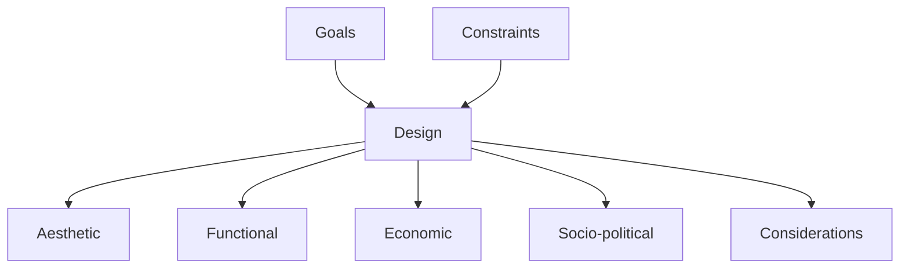
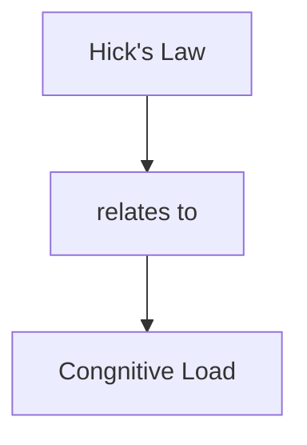

# Module - 1 Design101  Introduction Module - 1 

2026-08-07 11:21

Tags: #desgin

Author:  Duke Hsu

---

## Topic
1. Design: Definition
2. Psychology of Design
3. Ethics on Design

### 1.0 Definition 

Design means to plan , make or create a blueprint, drawing, or pattern for an object, building, or system before it is built. 

> Design is not just what it looks like & feels like . Design is how it works. - Steve Jobs

### 2.0 Psychology of Design

#### 2.1 Hick's Law 

It predicts that the time it takes to make a decision increases with the number and complexity of choices available. - William Edmund Hick and Ray Hyman, 1952

Key Takeaways

- Too many choices will increase the cognitive load for users
- Break up long or complex processes into screens with fewer options
- Use progressive onboarding to minimize cognitive load for new users. 

#### 2.2 Miller's Law

It predicts that the average person can only keep 7 (+-2) items in their working memory - George Miller, 1956

The act of visually grouping related information into small, distinct units of information . 

Key Takeaways 

- Don't use the "magical number seven". to justify unnecessary design limitations.
- Organize content into smaller chunks to help users process, understand , and memorize easily .

#### 2.3 Jakob's Law of Internet User Experience

It states that users spend most of their time on other sites, and they prefer your site to work the same way as all the other sites they already know.  - Jakob Nielsen, 2000

- Users will transfer expectations they have built around one familiar product to another that appears similar.
- By leveraging existing mental models, we can create superior user experiences in which the user can focus on their task rather than learning new models. 
- Minimize discordance by empowering users to continue using a familiar version for a limited time .

#### My own opinion 

- Avoid overly complex UI and too many text-based options. 
- Use simple and consistent icons.
- This reduces the learning curve, allowing users to get started more quickly and improving user retention . 

### 3.0 Ethics on Design 

A design made with the intent to do good , and unethical design is its black hat counterpart. 

<svg viewBox="0 0 780 500" xmlns="http://www.w3.org/2000/svg">
  <text x="330" y="45" font-family="Arial, sans-serif" font-size="32" font-weight="bold" text-anchor="middle" fill="#cccccc">Respect</text>

  <polygon points="330,70 392,175 268,175" fill="#fdeb9e" />
  <polygon points="268,175 392,175 454,280 206,280" fill="#fbd34d" />
  <polygon points="206,280 454,280 560,460 100,460" fill="#f9b915" />

  <text x="330" y="163" font-family="Arial, sans-serif" font-size="14" text-anchor="middle" fill="#333333">Delightful</text>

  <text x="330" y="228" font-family="Arial, sans-serif" font-size="15" text-anchor="middle" fill="#333333">Functional,</text>
  <text x="330" y="248" font-family="Arial, sans-serif" font-size="15" text-anchor="middle" fill="#333333">convenient &amp; reliable</text>

  <text x="330" y="340" font-family="Arial, sans-serif" font-size="15" text-anchor="middle" fill="#333333">Decentralised, private, open,</text>
  <text x="330" y="360" font-family="Arial, sans-serif" font-size="15" text-anchor="middle" fill="#333333">interoperable, accessible, secure &amp;</text>
  <text x="330" y="380" font-family="Arial, sans-serif" font-size="15" text-anchor="middle" fill="#333333">sustainable</text>

  <text x="590" y="168" font-family="Arial, sans-serif" font-size="16" font-weight="bold" fill="#cccccc">Human Experience</text>
  <text x="590" y="231" font-family="Arial, sans-serif" font-size="16" font-weight="bold" fill="#cccccc">Human Effort</text>
  <text x="590" y="335" font-family="Arial, sans-serif" font-size="16" font-weight="bold" fill="#cccccc">Human Rights</text>
</svg>

#### 3.1  Ethical Design Best Practices

- Use data to improve the human experience
- Advertising without tracking
- Always, always prioritize usability
- Don't ask for more than you need
- Be transparent

----
## References

- Module 1 PPT
