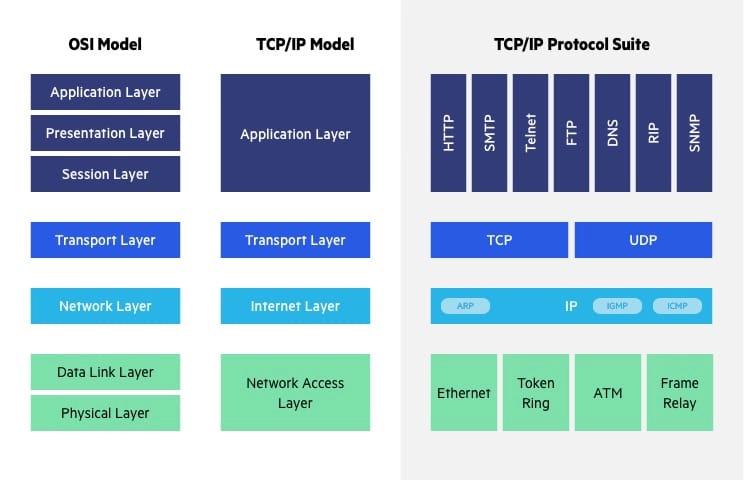
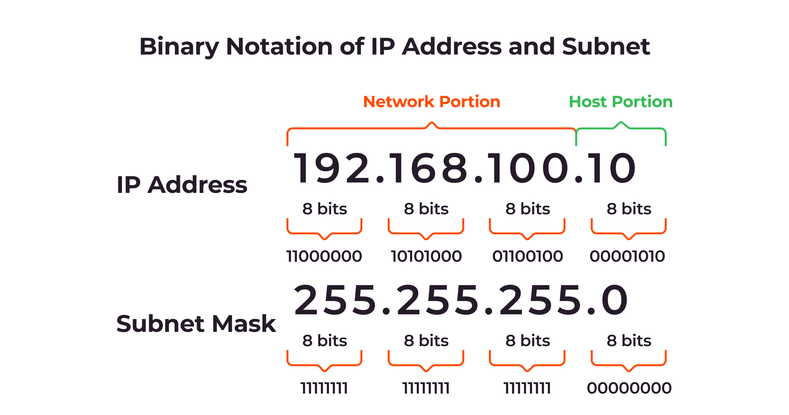
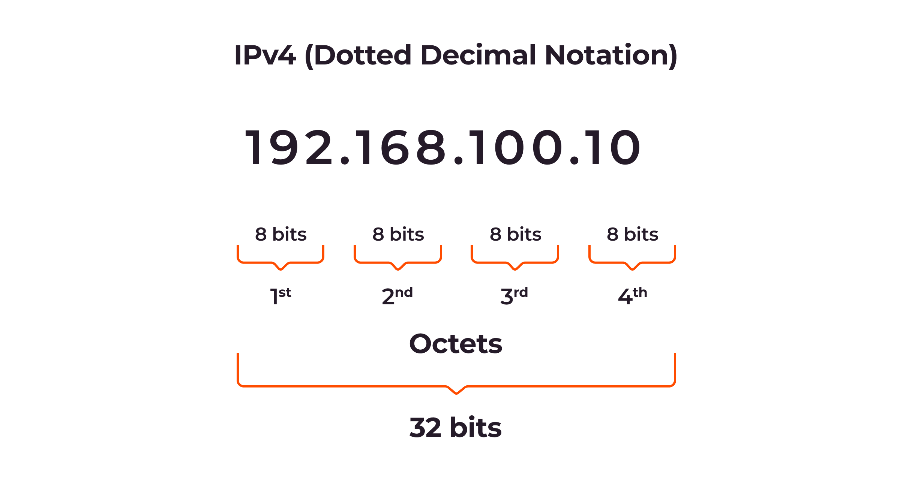
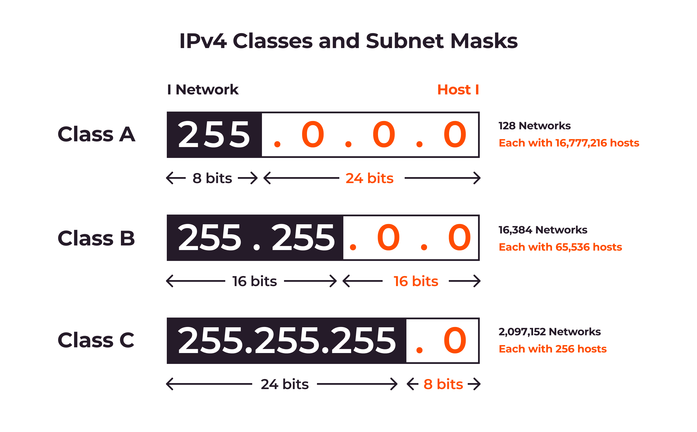
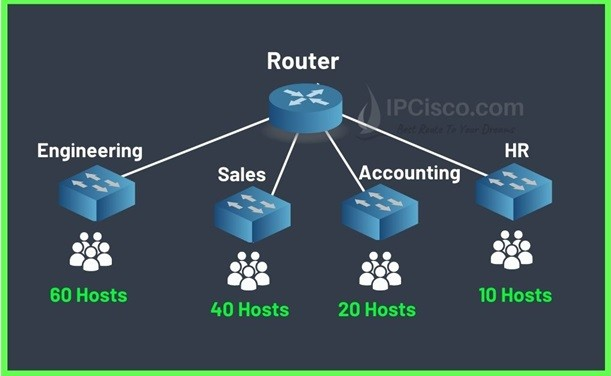
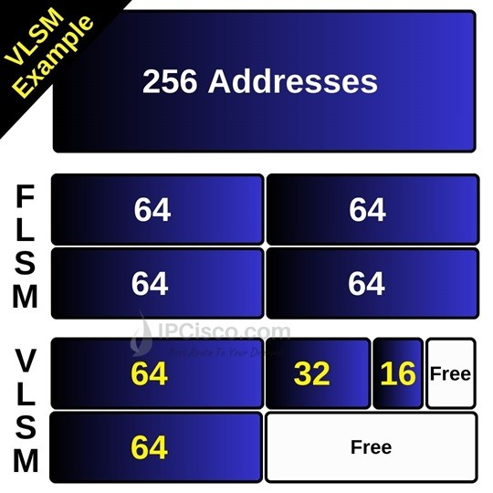
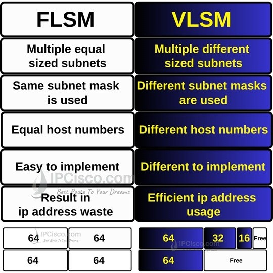

#  Knowledge Review 

2026-08-08 07:14

Tags: #Network 

Author:  Duke Hsu

---

## OSI Model Explained

- 7 Application Layer  - applications can access the network services.(HTTP/POP3/)
- 6 Presentation Layer - Encryption data , focus data Translation 
- 5 Session Layer - Manages  and Control the connections between computers. 
- 4 Transport Layer - (TCP/UDP) It ensures complete data transfer, error recovery, and flow control between hosts.
- 3 Network Layer - Is responsible for data routing, forwarding, 
- 2 Data Link Layer - Uses MAC addresses to handle the packets' journey across local networks and correcting any errors that occur. 
- 1 Physical Layer  - Converts the data into electrical signals, which are transmitted over fiber-optic cables 

## IP addresses 

IPV4
- 32 bit address 
- Dec formart
- 
IPV6
- 128 bit address
- Unlimited 
- 

Question: What different about public ip address and private address

- Public IP address Visible across the entire internet — any device on the internet can see and potentially communicate with it
- Private IP address Only visible within a local network — hidden from the internet by a router or firewall

## Subnet Mask 

255.255.255.0

Question: How many IP Address Classes?

- Class A:
  -  Range: `1.0.0.0` to `127.255.255.255`
  - Use: Huge networks (First number is the network ID)

- Class B:
  - `128.0.0.0` to `191.255.255.255`
  - Use: Medium networks (First two numbers are the network ID)

- Class C:
  - Range: `192.0.0.0` to `223.255.255.255`
  - Use: Small home or office networks (First three numbers are the network ID)

$Number of hosts = 2suqa(hostBit) -2$

Question: VLSM vs FLSM?

VLSM Example

Here, we will use the below subnet masks and **CIDR values** for each department:

- **Engineering** (60 users) **/26** (64 available address) **255.255.192**
- **Sales** (40 users)             **/26** (64 available address) **255.255.192**
- **Accounting** (20 users)   **/27** (32 available address) **255.255.224**
- **HR** (10 users)                 **/28** (16 available address) **255.255.240**

Let’s write the ip addresses of each subnet.

**Engineering (/26  255.255.255.192)**

- Network Address:**168.1.0**
- First Host Address: **168.1.1**
- Last Host Address:**168.1.62**
- Broadcast Address: **168.1.63**

**Sales (/26  255.255.255.192)**

- Network Address:**168.1.64**
- First Host Address: **168.1.65**
- Last Host Address:**168.1.126**
- Broadcast Address: **168.1.127**

**Accounting (/27  255.255.255.224)**

- Network Address:**168.1.128**
- First Host Address: **168.1.129**
- Last Host Address:**168.1.158**
- Broadcast Address: **168.1.159**

**Engineering (/28  255.255.255.240)**

- Network Address:**168.1.160**
- First Host Address: **168.1.161**
- Last Host Address:**168.1.174**
- Broadcast Address: **168.1.175**

## Routing Table

Network routing is the process of selecting a path across one or more networks .

A [routing table](https://www.techtarget.com/searchnetworking/definition/routing-table) is ==a data file or set of rules stored in a router's memory==. It acts as a map that tells network devices how to forward data packets toward their final destination. [[1](https://en.wikipedia.org/wiki/Routing_table), [2](https://www.geeksforgeeks.org/computer-networks/routing-tables-in-computer-network/)]

Key Components of a Routing Table

- **Destination Network:** The target IP address or subnet mask of the final network where the packet needs to go.

- **Subnet Mask:** A number that splits the IP address into the network part and the host part.

- **Next Hop:** The IP address of the next router on the path to the destination.

- **Interface:** The physical or virtual network port the router uses to send out the packet.

- **Metric:** A cost value that helps the device pick the best and fastest path. Lower numbers mean better routes. [[1](https://www.tutorialspoint.com/data_communication_computer_network/routing_table.htm)]

Types of Routes in a Table

- **Directly Connected:** Added on its own when a network is physically plugged into the router.

- **Static Routes:** Manually typed in and fixed by a network admin.

- **Dynamic Routes:** Automatically learned and updated by routing protocols like OSPF or BGP. [[1](https://jumpcloud.com/it-index/what-is-a-routing-table), [2](https://www.ipxo.com/blog/network-routing/)]

Question:  What is RIP in network 
- In networking, **RIP** stands for ==**Routing Information Protocol**==, one of the oldest distance-vector routing protocols used to help routers find the best path for data packets across an IP network. It uses a simple hop count metric (counting the number of routers a packet passes through) with a maximum limit of 15 hops to prevent loops.

## OSPF

## Different Topology 

7 Types Network Topologies 

- **Point-to-point topology:** A direct connection between two devices for dedicated communication.
- **Bus topology:** All devices connect to a single cable (bus). Inexpensive and straightforward, but can be challenging to troubleshoot, and a break in the bus affects the entire network. 
- **Star topology:** All devices connect to a central hub or switch. Easy to manage and troubleshoot, but the central device can be a single point of failure. 
- **Ring topology:** Devices are connected in a closed loop. Data travels in one direction, making implementation and troubleshooting challenging, and a break in the ring can affect the entire network. 
- **Mesh topology:** Devices are interconnected with multiple paths. Highly reliable and fault-tolerant, but can be complex and expensive. 
- **Tree topology:** A hierarchical structure with a root node and branches. Scalable and easy to manage, but can be complex to design and maintain. 
- **Hybrid topology:** A combination of two or more topologies.

Question: What is the function of DNS  server ?
- They form the foundation of the [Domain Name System (DNS)](https://www.ibm.com/think/topics/dns), often referred to as the “phone book of the internet,” enabling users to access websites by entering domain names into a web browser instead of recalling and entering numerical IP addresses.

Question: What is the function of DHCP server?
- ==automatically assigns IP addresses, subnet masks, and network settings to devices when they join a network==. It handles this through four main steps: discovery, offer, request, and acknowledgment. This automation stops address conflicts and saves time.  

Question: proxy server
- A proxy server ==acts as a middleman between your device and the internet==. It takes your request to visit a website, sends it to that site for you, gets the reply, and sends that reply back to your device. This setup helps hide your real IP address, blocks bad web pages, and speeds up loading times

## Authentication server

An authentication server is used to verify credentials when a person or another server needs to prove who they are to an application.

----
## References

https://gcore.com/learning/what-is-a-subnet-how-subnetting-works

https://www.imperva.com/learn/application-security/osi-model/

https://www.meridianoutpost.com/resources/articles/IP-classes.php#classd

https://ipcisco.com/lesson/vlsm-subnetting/

https://www.cloudflare.com/learning/network-layer/what-is-routing/

https://www.ibm.com/think/topics/dns-server

https://www.selector.ai/learning-center/7-network-topologies-pros-cons-and-how-to-design-your-topology/

