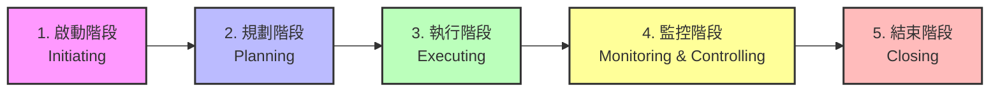

# Module - 1 Introduction to Project Management 

2026-08-04 10:18

Tags: #pm

Author:  Duke Hsu

---
## Topic 

1. Project Definition
2. Project Management Definition
3. PM Task and Responsibilities
4. Stakeholders in Project Management
5. Types of Stakeholders
6. Phases of Project Management
7. Project Management Methodologies

## 1.0 Project 

A project is a planned piece of work or temporary task with a clear beginning and end . It is designed to make something new, solve a problem, or reach a specific goal . 

## 2.0 Project Management

- Use your owner knowledge , skills, tools, and techniques to complete a series of tasks to deliver value and achieve a desired outcome .

- It is a process that allows project managers to plan , execute, track and complete projects with the help of a project team. 

### 2.1 Project manager

- A professional who organizes, plans, and executes projects while working within restraints like budgets and schedules. 
- Lead entire teams, define project goals, communicate with stakeholders, and see a project through to its closure. 
- Whether running a marketing campaign , constructing a building, developing a computer system, or launching a new product, the project manager is responsible for the success or failure of the project .

## 3.0 Project Manager's Task and Responsibilities

- Defining the scope of the project 
- Staying on schedule 
- Planning a project's cost and sticking to a budget 
- Documenting the progress of the project 
- Assessing risks
- Troubleshooting
- Leading quality assurance

Goal > Schedule > Cost > Documents > Risks > Troubleshooting  > Quality Control 

## 4.0 Stakeholders in Project Management 

Stakeholders 
- Your Client / Invested / Boss
- An individual , group, or entity with a vested interest in a project, organization , or business. 

### 4.1 Types of Stakeholders

- Internal Stakeholders 
  Example:  ADU Register System  - MIT IT Department
- External Stakeholders
  Example:  PLDT / Globe /Jolibee
  
### 4.2 Stakeholders in Project Management 

- The Senior Manager  - Who pay
- Project Managers - Team leader
- Practitioners - Programmer 
- Customer - Someone request your create it 
- End Users - who use it / normal people

## 5.0  Five phases of Project Management Lifecycle

| Phases          | What need to do                                                                                  |
| --------------- | ------------------------------------------------------------------------------------------------ |
| Initiation      | Project Charter / Feasibility Study / Business Case                                              |
| Planning        | Scope and Budget / Work Breakdown / Schedule / Gantt Chart / Communicate Plan / Risks Management |
| Execution       | Status and Tracking / KPIs / Quality / Forecast                                                  |
| Monitor&Control | Objectives / Quality Deliverables /Effort and Cost / Tracking /  Performance                     |
| Closure         | Post Mortem /Project Punch List / Reporting                                                      |

## 6.0 Nine Project Management Methodologies 

[Nine_Project_Management_Methodologies](Nine_Project_Management_Methodologies.md)

----
## References
