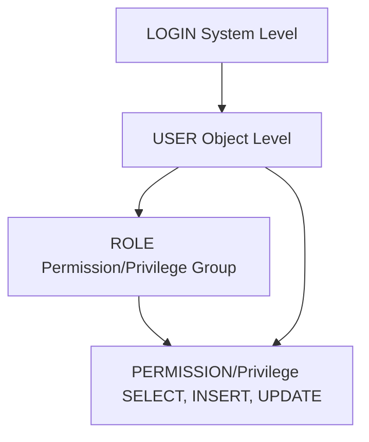

# Exercise - 5 Data Control Language

2026-03-28 13:14

Tags: #ADV_DBMS 

Author:  Duke Hsu

---


## Key concepts 

- **SCHEMA**  -  A schema is a folder inside a database that organizes tables and objects.

- **dbo, dbs**  -  These are schema names (like folders), where **dbo** is the default and **dbs** is a custom one.

- **System privilege** - A system privilege gives a user permission to perform actions on the whole database or server.

- **Object privilege**  - An object privilege allows a user to access or modify a specific object like a table.

- **GRANT OPTION**  - It allows a user not only to use a privilege but also to give it to other users.

- **REVOKE   ,  CASCADE**  - REVOKE removes a privilege, and CASCADE also removes all privileges given by that user to others.

- **ROLE**  - A role is a group of permissions that can be assigned to multiple users for easier management.


**Concepts SQL Example:** 

```sql
-- Step 1: Create a schema
CREATE SCHEMA dbs;

-- Step 2: Create a table
CREATE TABLE dbs.regions (
    region_id INT,
    region_name VARCHAR(50)
);

-- Step 3: Create users
CREATE LOGIN duke WITH PASSWORD = 'P-LG9XTLqhtH';
CREATE LOGIN ora23 WITH PASSWORD = 'P-LG9XTLqhtH';

CREATE USER duke FOR LOGIN duke;
CREATE USER ora23 FOR LOGIN ora23;


-- Step 4: Create a role
CREATE ROLE sales_role;

-- Step 5: Grant permission to the role (object privilege)
GRANT SELECT ON dbs.regions TO sales_role;

-- Step 6: Add user to role
ALTER ROLE sales_role ADD MEMBER duke;

-- Step 7: Grant with GRANT OPTION
GRANT SELECT ON dbs.regions TO duke WITH GRANT OPTION;

-- Step 8: duke grants to another user
GRANT SELECT ON dbs.regions TO ora23;

-- Step 9: Revoke with CASCADE
ALTER ROLE sales_role DROP MEMBER duke;
REVOKE SELECT ON dbs.regions FROM duke CASCADE;
```


**Assign schema ownership to a user**

```sql
-- Assign schema ownership to a user
ALTER AUTHORIZATION ON SCHEMA::dbs TO duke;

-- Change the ownership of a table
ALTER AUTHORIZATION ON OBJECT::dbs.regions TO duke;

-- Change the ownership of a stored procedure
ALTER AUTHORIZATION ON OBJECT::dbs.sp_GetEmployees TO duke;

-- Change the ownership of a database
ALTER AUTHORIZATION ON DATABASE::A102 TO duke;
```


**Check users**

```sql
SELECT name 
FROM sys.database_principals
WHERE name = 'duke';
```


**Users drop** 

```sql
DROP USER duke; -- delete user from   sys.database_principals

DROP LOGIN duke; -- delete user from login
```

### Flowchart 




----
### References
