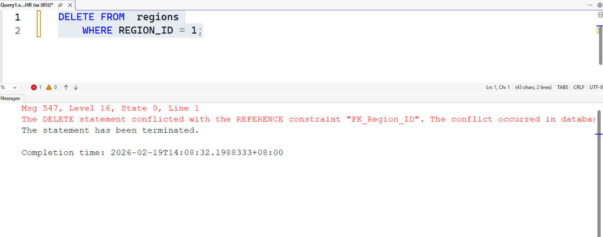

2026-02-19 13:54

Tags: #ADV_DBMS 
Author:  Duke Hsu

---
## Lab Notes: MSSQL Debugging Approach

### Basic step 

1. Check the message window and pay attention to the table or column information.
2. Use `EXEC sp_help 'departments' ;`  to check the table structure 
3. Verify the foreign keys and primary keys in the table.
4. Check the data content and structure.
5. Look for any syntax errors.


### Example

**Task: Delete specific rows from the `regions` table**

**Code** 

```sql
DELETE FROM regions
	WHERE REGION_ID = 1;
```

**Shotscreen**

Error :  Can’t delete it because REGION_ID is used as a foreign key in another table. 




#### Step by step 

Use `EXEC sp_help 'countries' ;` to check the `countries` table structure 

!!! note
	Why we need  check the `countrie` table, because `REGION_ID` is  a foreign key in the  `countries` table. 


1. Drop the constraint in the `countries` table using `ALTER` (DDL).

```sql
ALTER TABLE countries
	DROP CONSTRAINT FK_Region_ID; --drop the constraint first 
```

2. Then run the `DELETE` again (or make other required changes).

```sql
DELETE FROM regions
	WHERE REGION_ID = 1;
```

After dropping the foreign key `REGION_ID` from the `countries` table, we are able to modify the `regions` table.

3. Afterward, the foreign key constraint (`REGION_ID`) should be re-added to the `countries` table.

```sql
ALTER TABLE countries
	ADD CONSTRIANT FK_country_reg FOREIGN KEY (REGION_ID)
	REFERENCES regions(REGION_ID)

ON DELETE CASCADE
ON UPDATE CASCADE;
```


----
### References

Instructor’s In-Class Demonstration

