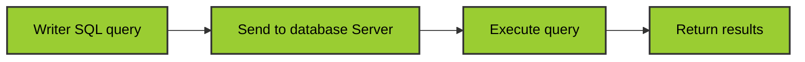

01/22/2026
#ADV_DBMS 
Made by Duke Hsu

---
### History of SQL
- 1970 -  E.F.Codd Develops Relational database concept 
- 1974-1979  - System R with Sequel(Later SQL) created at IBM Research Lab
- 1979 - Oracle markets first Relational DB with SQL 
- 1981 - SQL /DS First available RDBMS system on DOS / VSE
- Others followed: INGRES(1981),IDM(1982),DG/SGL(1984),Sybase(1986)
- 1986 - American National Standard Institute (ANSI) SQL Standard released 
- 1989,1992,1999,2003,2006,2008 - Major ANSI Standard Updates
- Current: SQL is Supported by major database vendors
### What is SQL?
- Structured Query Language(SQL) is the standard language used to interact with relational database. 
- It allows users to store , retrieve, update and manage data efficiently through simple commands. 
- It is known for its user-friendly syntax and powerful capabilities , SQL is widely used across industries.

SQL is pronounce "Sequel" or sometimes "ess-cue-ell"

**Before SQL**
	- Manual file systems
	- Slow retrieval
	- Inconsistent storaage
**After SQL**
	- Structure data
	- Fast querying
	- Data integrity

### Uses of SQL
SQL is used by organizations to interact with databases which store and manage data in a structured and efficient way . 

**Use SQL for:**
- Creating , Modifying, and deleting database tables and records
- Inserting, updating, and deleting data in a database
- Retrieving data from a database with SELECT statements
- Grouping and aggregating data
- Joining data from multiple tables
- Creating views and stored procedures
- Performing data analysis and data mining
- Managing the security and permissions of a database
- Monitoring and optimizing database performance
- Backing up and restoring databases

### How SQL Works


### Key Components of a SQL System 

- **Databases:** A databases is a structured collection of data. It organizes data into **tables**, which are like spreadsheets with rows(records) and columns(fields).
- **Tables:** Each table enforces rules and relationships among its columns for data integrity.
- **Indexes:** Indexes speed up queries by allowing the database to quickly locate data without scanning the entire table.
- **Views:** A view is a virtual table basically a saved SELECT statement you can query like a table.
- **Transactions:**  A transaction groups multiple SQL operations into a single unit. It ensures all changes are applied successfully or none are, preserving data integrity (ACID properties)
- **Security and Permissions:** SQL includes tools to restrict access, letting DBAs assign who can do what whether it's accessing tables, executing procedures, or changing structures. 
- **Joins:** Joins combine data from multiple tables based on relationships essential for querying across related datasets. 
- **Whitespace Allowed:**  Queries can span multiple lines but use spaces between keywords and names. 
- **Reserved Words:** Avoid using SQL keywords as names. If needed, wrap them in quotes`"`or backticks`''`


**SQL Reserved Words:**

> https://support.microsoft.com/en-us/office/sql-reserved-words-b899948b-0e1c-4b56-9622-a03f8f07cfc8


### Rules for Writing SQL Queries

By following these rules, queries will be well formed and well executed in any database. 
Would ensure consistency and functionality across databases. 

- **End with Semicolon`;`**    Each SQL statement must end with a semicolon to execute properly.
```sql
USE sys.database;
GO;
```
- **Case Insensitivity:**   SQL keywords(e.g., SELECET, INSERT) are not case sensitive. However, table or column names may be case-sensitive depending on the DBMS. 

### SQL Environment 
1. **Catalog:**   A set of schema that constitute the description of a database.
	 - Example:  A shopping mall how many floor/ area / structure
2. **Schema:** The structure that contains descriptions of objects created by a user
	- Example: A shopping mall  1F: food / 2F: Cloth , shoes / 3F: Movies
	- Tables / Views / Functions / Procedures
3. **Data Control Language:**  Commands that controls a database including administrating privileges and committing data 
	- DCL
	- Control the user what they can do 
	- GRANT (授權) / REVOKE （收回權限） / DENY (拒絕)
	- Normal user views data only / Admin can  INSERT , DROP , UPDATE
4. **Data Manipulation Language:** Commands that maintain and query a database
	- DML 
	- SELECT / INSERT / UPDATE / DELETE 
5. **Data Definition Language:**  Commands that define a database, including creating, altering , dropping tables and establishing constraints. 
	- CREATE
	- ALTER
	- DROP
	- TRUNCATE

 
```sql
--DCL 
GRANT SELECT, INSERT ON Employees TO user1;
REVOKE INSERT ON Employees FROM user1;
DENY DELETE ON Employees TO user1;

--DML 
INSERT INTO Customers(CustomerID, Name, City)
	VALUES(1,'John Doe','New York');

UPDATE Customers
	SET City = 'Los Angeles'
	WHERE CustomerID= 1;

SELECT * FROM Customers;

DELETE FROM Customers
	WHERE CustomerID= 1;
	
--DDL ref module 2

```
 DDL: [[Module 2 - Data Definition Language  (DDL)]]


>**SQL Environment** consists of catalog, schema, and SQL command languages (DDL, DML, DCL) used to define, manipulate, and control a database.

### Different SQL Commands or Queries 

**SQL Commands**
	- DDL
	- DML
	- TCL
	- DQL
	- DCL

**TCL** - Transaction Control Language

The primary TCL commands are:

| Command               | Description                                                                                                                                     | Example                                         |
| --------------------- | ----------------------------------------------------------------------------------------------------------------------------------------------- | ----------------------------------------------- |
| **`COMMIT`**          | Permanently saves all changes made during the current transaction to the database. Once committed, changes cannot be rolled back.               | `COMMIT;`                                       |
| **`ROLLBACK`**        | Undoes all changes made in the current transaction since the last `COMMIT` or `ROLLBACK` command, restoring the database to its previous state. | `ROLLBACK;`                                     |
| **`SAVEPOINT`**       | Creates a named point within a transaction to which you can later roll back without affecting the entire transaction.                           | `SAVEPOINT savepoint_name;`                     |
| **`SET TRANSACTION`** | Configures the characteristics of the current transaction, such as the isolation level.                                                         | `SET TRANSACTION ISOLATION LEVEL SERIALIZABLE;` |
Importance of TCL

- **Data Integrity:** TCL ensures that the database remains in a consistent state, even in the event of system failures.
- **Atomicity:** It enforces the ACID property of atomicity, guaranteeing that all operations within a transaction either succeed as a whole unit or fail completely.
- **Error Handling:** It allows for controlled error handling through `ROLLBACK` and `SAVEPOINT`, preventing partial or incorrect data updates.

**COMMIT**
```sql
--TCL 

BEGIN TRANSACTION;

UPDATE accounts 
	SET balance = balance - 100 WHERE account_name = 'duke';

UPDATE accounts 
	SET balance = balance + 200 WHERE account_name = 'six';

COMMIT;
 
```

**ROLLBACK**
```sql
BEGIN TRANSACTION;

UPDATE accounts
	SET balance = balance - 100 WHERE account_name = 'duke';

ROLLBACK;
```

**SAVEPOINT**
```sql
BEGIN TRANSACTION;

INSERT INTO Orders
	VALUES(1,'Laptop',30000);

SAVE TRAN SavePoint_1;

INSERT INTO Orders
	VALUES(2,'iPhone',50000);

ROLLBACK TRAN SavePoint_1;

COMMIT;
```

>TCL statements are used to manage transactions in a database, allowing changes to be committed or rolled back.


### SQL Data types

| NUMERIC | BINARY | STRING  | BOOLEAN | DATE/TIME | SPECIAL |
| ------- | ------ | ------- | ------- | --------- | ------- |
| INT     | BINARY | CHAR    | BOOLEAN | DATE      | UUID    |
| DECIMAL | BLOB   | VARCHAR |         | TIME      | AON     |
| FLOAT   |        | TEXT    |         | DATETIME  | XML     |
| NUMERIC |        |         |         |           | JSON    |

>https://learn.microsoft.com/zh-tw/sql/t-sql/data-types/decimal-and-numeric-transact-sql?view=sql-server-ver17

![[Pasted image 20260123162455.png]] 


----
References: 
PPT module 1
