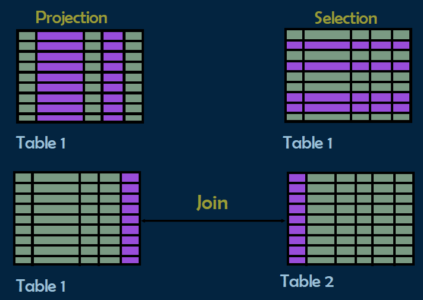
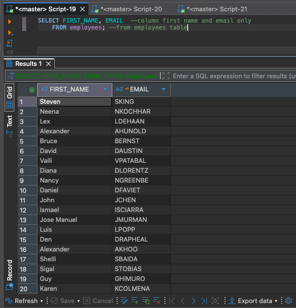
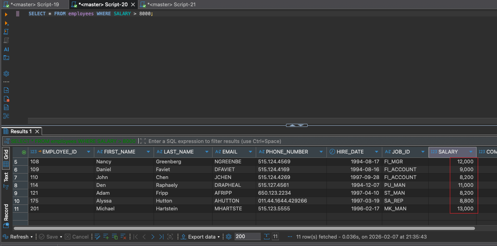
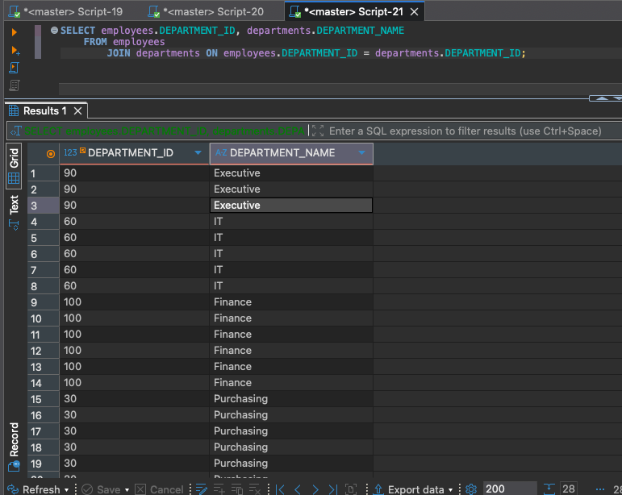
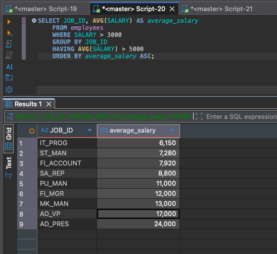

2026-02-07 21:03

Tags: #ADV_DBMS 
Author:  Duke Hsu

---

Module 4 - Data Manipulation Language -Part 2 

## Module Intended Learning Outcome 
- Construct single table queries using SQL SELECT command
- Make use of different aggregated functions to customize output 


## Topic  / Concept

### Capabilities of SQL Select statement

 


**Projection  (投影)**

Use `SELECT` to select specific columns in a table.
使用 `SELECT` 選定table 中特定的某一些column . 

Example:
```sql
SELECT FIRST_NAME, EMAIL  --column first name and email only 
	FROM employees; --from employees table
	
```




**Selection (選擇)**

Filter data (rows) based on specific condition.
通過特定的條件來篩選符合要求的數據（rows）

Example:
```sql

SELECT * FROM employees WHERE SALARY > 8000;
--select  all  from {table_name} where {condition}; 
```




**Join (連接)**

Two different tables are linked together based on a common field/column (such as ID) and merged into a single set of data.
將兩張不同的表，基於某個共同的欄位（如 ID）關聯起來，合併成一組數據。

Example:
```sql

SELECT employees.DEPARTMENT_ID, departments.DEPARTMENT_NAME
	FROM employees
		JOIN departments ON employees.DEPARTMENT_ID = departments.DEPARTMENT_ID;
```



其它還有
1. INNER JOIN
2. LEFT JOIN
3. RIGHT JOIN
4. FULL OUTER JOIN

請參閱文檔: [[JOIN TABLE]]

### Select Statement 
- Used for queries on single or multiple tables
- Clauses of the SELECT statement

```sql
SELECT JOB_ID, AVG(SALARY) AS average_salary
	FROM employees
	WHERE SALARY > 3000
	GROUP BY JOB_ID
	HAVING AVG(SALARY) > 5000
	ORDER BY average_salary ASC; --DESC 是從大到小


```



### SQL Operators 

SQL operators are symbols or keywords used to perform operations on data in SQL queries 

#### Arithmetic Operators

Arithmetic Operators in SQL are used to perform mathematical operations on numeric data types in  SQL queries.

| symbol | meaning        | example |
| ------ | -------------- | ------- |
| +      | Addition       |         |
| -      | Subtraction    |         |
| *      | Multiplication |         |
| /      | Division       |         |
| %      | Modulus        |         |


Example:


```sql
SELECT EmployeeName, Salary, Bonus,
	Salary + Bonus AS Total_Income, --Addition
	Salary - Bonus AS After_Bonus_Deduction, --subtraction
	Salary * 0.10 AS Ten_Percent_Tax, --multiplication
	Salary / 30 AS Dayly_Salary, --division
	Salary % 10000 AS Salary_Remainder --modulus
FROM Employees;
```

---

#### Comparison Operators

Comparison Operators in SQL are used to compare on expression's value to other expressions. 


| symbol | meaning                  | example |     |     |
| ------ | ------------------------ | ------- | --- | --- |
| =      | Equal                    |         |     |     |
| !=     | Not Equal                |         |     |     |
| <>     | less than and great than |         |     |     |
| <      | Less than                |         |     |     |
| >      | Great than               |         |     |     |
| >=     | Great than or Equal      |         |     |     |
| <=     | Less than or Equal       |         |     |     |


```sql
SELECT *
	FROM Students
	WHERE Score >=70;
	

SELECT *
	FROM Students
	WHERE Score <=50;
```

```sql
SELECT *
	FROM Students
	WHERE Age <> 18;
```


#### Logical Operators 

Logical Operators in SQL are used to combine or manipulate conditions in SQL queries to retrieve or manipulate data based on specified criteria. 


| symbol | meaning               | example |     |
| ------ | --------------------- | ------- | --- |
| AND    | result should be True |         |     |
| OR     | True or False         |         |     |
| NOT    | False                 |         |     |


Example:


```sql

--AND
SELECT *  
	FROM Students 
		WHERE Score >=70 AND Age >=18; --both conditions must be true 


--OR
SELECT * 
	FROM Students
		WHERE Score <60 OR Age <18; --either conditioncan be true

--NOT
SELECT *
	FROM Students
		WHERE NOT Score >=50;


```


#### Bitwise Operators

Compound operators combine an operation with assignment. These operators modify the  value of a column and store the result in the same column in a single step


| symbol | meaning    | example |     |
| ------ | ---------- | ------- | --- |
| &      | AND        |         |     |
| \|     | OR         |         |     |
| ^      | XOR        |         |     |
| ~      | NOT        |         |     |
| <<     | Left move  |         |     |
| >>     | Right move |         |     |


8 bit

$2^7 - 2^6- 2^5- 2^4- 2^3- 2^2- 2^1- 2^0$
$128-64-32-16-8-4-2-1$

---


| **Bit position (from left to right)** | **1**  | **2**  | **3**  | **4**  | **5**      | **6**  | **7**      | **8**  |
| ------------------------------------- | ------ | ------ | ------ | ------ | ---------- | ------ | ---------- | ------ |
| **Binary number 170**                 | 1      | 0      | 1      | 0      | 1          | 0      | 1          | 0      |
| **Binary number 75**                  | 0      | 1      | 0      | 0      | 1          | 0      | 1          | 1      |
| **Compare**                           | $1\&0$ | $0\&1$ | $1\&0$ | $0\&0$ | **$1\&1$** | $0\&0$ | **$1\&1$** | $0\&1$ |
| **AND Result**                        | **0**  | **0**  | **0**  | **0**  | **1**      | **0**  | **1**      | **0**  |

00001010 =  2+ 8 = 10
 
---


| **Bit position (from left to right)** | **1** | **2** | **3** | **4** | **5** | **6** | **7** | **8** |
| ------------------------------------- | ----- | ----- | ----- | ----- | ----- | ----- | ----- | ----- |
| **Binary number 170**                 | 1     | 0     | 1     | 0     | 1     | 0     | 1     | 0     |
| **Binary number 75**                  | 0     | 1     | 0     | 0     | 1     | 0     | 1     | 1     |
| **Compare**                           | 1\|0  | 0\|1  | 1\|0  | 0\|0  | 1\|1  | 0\|0  | 1\|1  | 0\|1  |
| **OR Result**                         | **1** | **1** | **1** | **0** | **1** | **0** | **1** | **1** |
|                                       |       |       |       |       |       |       |       |       |

11101011 = 128+ 64+32+8+2+1 = 235


#### Compound Operator

複合運算符
Compound operators combine an operation with assignment. These operators  modify the value of a column and store the result in the same column in a single step. 

| symbol | meaning | example |     |
| ------ | ------- | ------- | --- |
| +=     |         |         |     |
| -=     |         |         |     |
| *=     |         |         |     |
| /=     |         |         |     |
| %=     |         |         |     |


Example:

```sql
UPDATE stdudent
	SET score += 10
		WHERE studentID = 1;


UPDATE student
	SET score -= 10
		WHERE studentID = 2;

UPDATE student
	SET score /=2
		WHERE studentID = 3;

UPDATE student
	SET score *=2
		WHERE studentID =4;
		
```


#### Special Operators

- `BETWEEN .....AND .....`
- `IN(....)`
- `LIKE`
- `IS NULL`
- `EXISTS`


----

### References: 

MSSQL Group Functions - https://learn.microsoft.com/zh-cn/sql/t-sql/functions/aggregate-functions-transact-sql?view=sql-server-ver17


