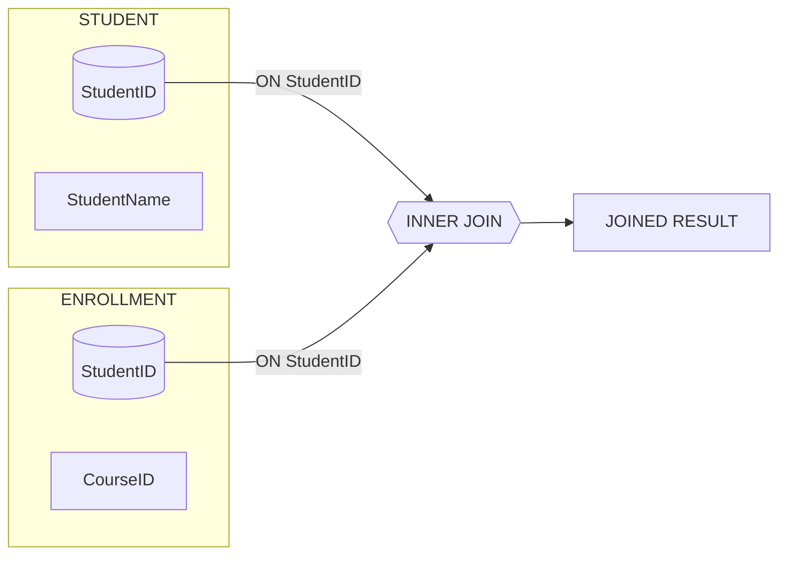
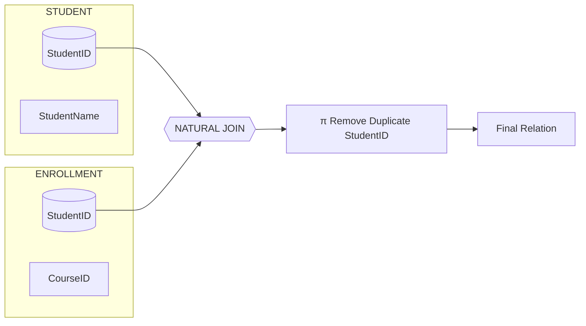
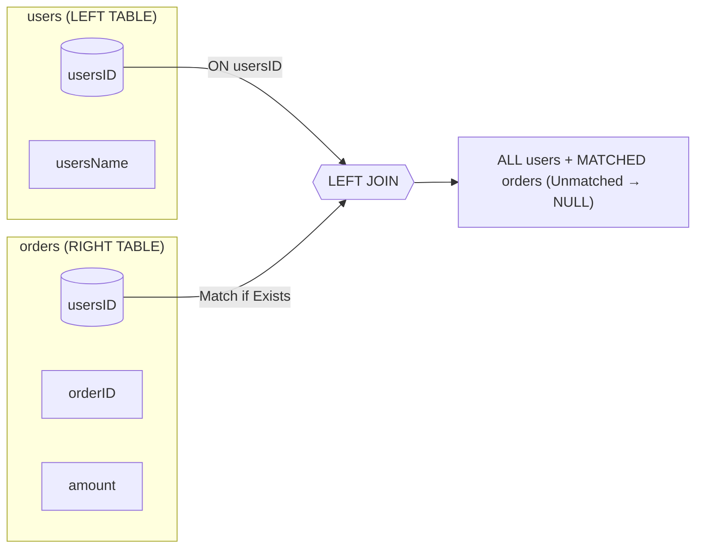
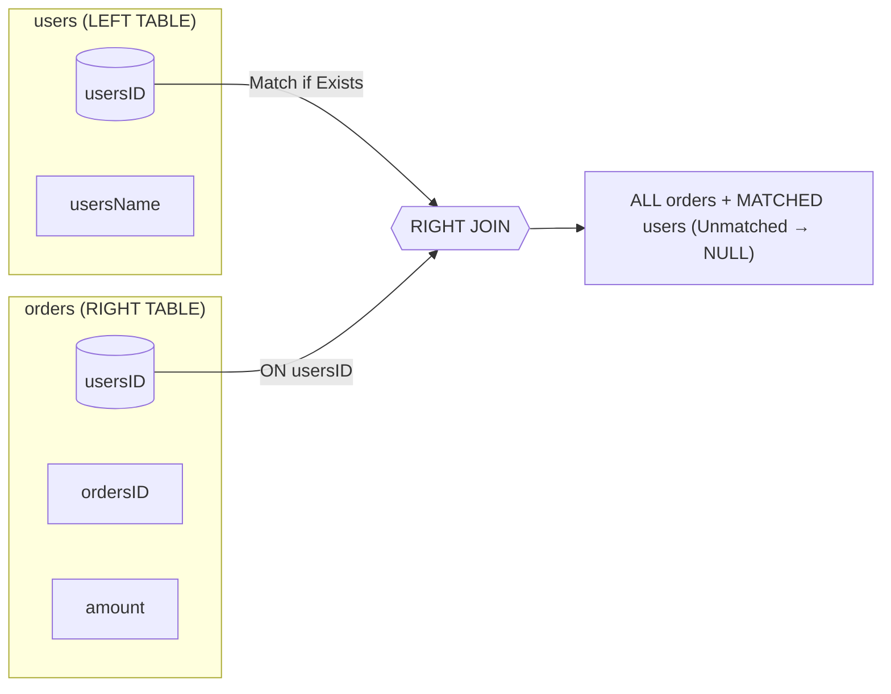

2026-02-18 21:07

Tags: #ADV_DBMS 
Author:  Duke Hsu

---
Module 5 - SQL Joins

## Topic  / Concept 

- Three types of joins
- Compare the difference of join and subqueries

### Three types of joins 

#### INNER JOIN 

- Return records that have matching values in both tables.

Syntax:

```sql
SELECT columns 
	FROM table_1
	INNER JOIN table_2
		ON table_1.common_column = table_2.common_column;
```




Example:

```sql
SELECT user.name, orders.orderID, orders.amount
	FROM users AS U
	INNER JOIN orders AS O
		ON U.userID = O.userID
```


#### NATURAL JOIN 

- A NATURAL JOIN  is a type of inner join that automatically matches columns between the two tables that have the same name and data type. The natural join implicitly uses these columns to perform the join  which can sometimes simplify queries. 

Syntax

```sql
SELECT columns 
	FROM table_1
		NATURAL JOIN table_2;
```


Example:

```sql
SELECT name, dept_name 
	FROM employees
		NATURAL JOIN departments;
```


!!!note
	 **Inner join**: requires explicit columns to be specified in the ON clause for the Join condition
	 **Natural join:** Automatically uses all columns with the same name and data type in both tables to join the tables.



#### LEFT JOIN 

- `LEFT JOIN `, returns all the rows from the **left table**, even if there are no matches in the right table , if there are no matches, `NULL`values will be returned in the columns of the right table 
- Right table not match -> NULL

Syntax:

```sql
SELECT column1,column2, column3....
	FROM left_table
	LEFT JOIN right_table
		ON left_table.column1 = ritgh_table.column1;
```


Example:

```sql
SELECT user.name, orders.orderID, orders.amount
	FROM users AS U
	LEFT JOIN orders AS O 
		ON U.userID = O.userID;
```





#### RIGHT JOIN 

- `RIGHT JOIN`  returns all rows from the **right table** , event if there are no matches in the left table , unmatched left-side columns will be `NULL`
- Left table not matched -> NULL


Syntax:

```sql
SELECT user.name, orders.orderID, orders.amount
	FROM users AS U
	RIGHT JOIN orders AS O 
		ON U.userID = O.userID;

```

Example:

```sql
SELECT user.name, orders.orderID, orders.amount
	FROM users AS U
	RIGHT JOIN orders AS O 
		ON U.userID = O.userID;
```




#### CROSS JOIN 

- The CROSS JOIN keyword returns the Cartesian product of two or more tables(combines every row from the first table with every row from the second table)

!!!note 
	 嵌入式for loop 的概念， 例子：2個3rows的table 通過cross join 會變成1個9rows的table


Syntax :

```sql
SELECT column1,column2....
	FROM table1
		CROSS JOIN table2;
```


Example:

```sql
SELECT * 
	FROM meals
		CROSS JOIN drinks;
	
```


#### FULL OUTER JOIN

- FULL OUTER JOIN , returns all records when there is a match in either left or right table 

Syntax:

```sql
SELECT column1,column2,column3....
	FROM table1
		FULL OUTER JOIN table2
	ON table1.column1 = table2.column2
	WHERE condition;
```

Example:

```sql
SELECT CITY, STATE_PROVINCE
	FROM  locations AS L
		FULL OUTER JOIN countries AS C
	ON L.COUNTRY_ID = C.COUNTRY_ID
	WHERE CITY IS NOT NULL ;
```


Gemini canvas 

https://gemini.google.com/share/531b591e835c


----
### References

Module 5: SQL Joins.PPTX