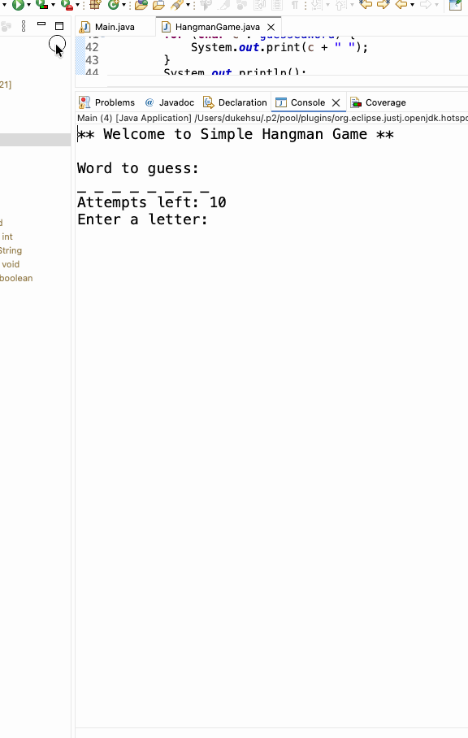
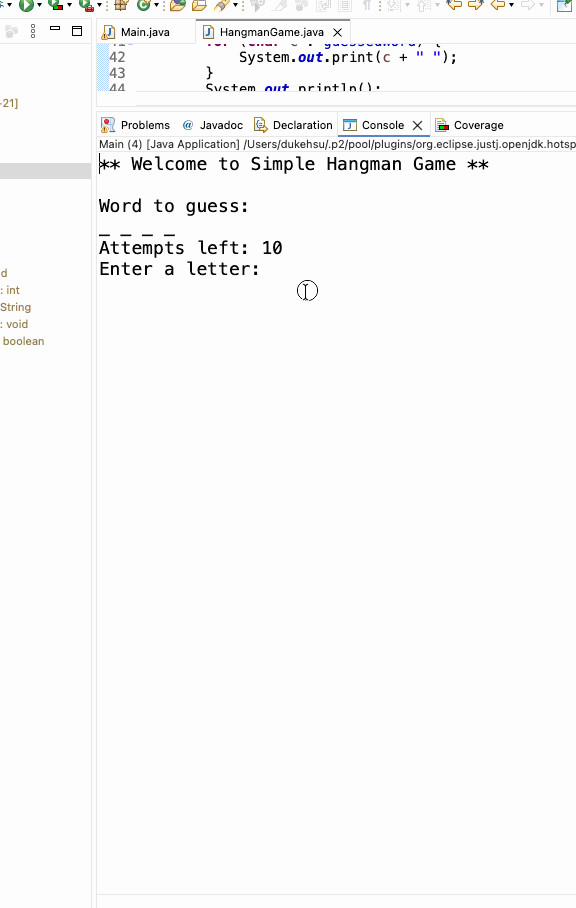
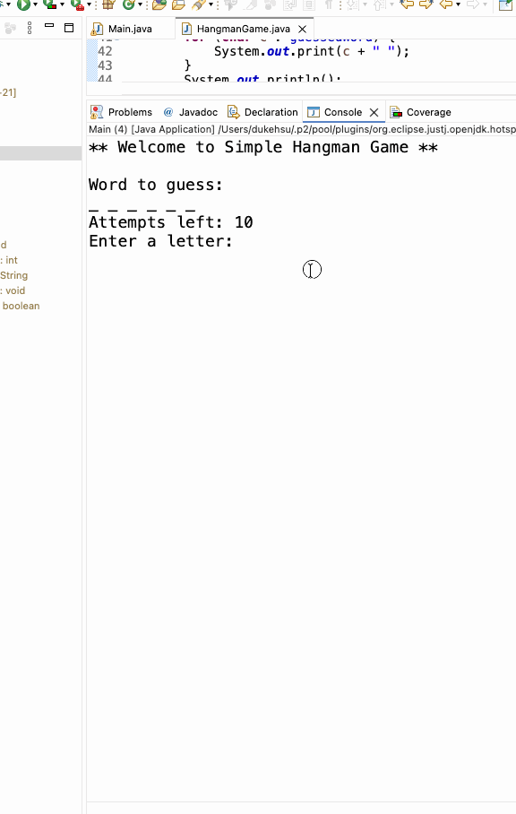

# LAB Activity 04082026

2026-04-01 20:23

Tags: #java 

Author:  Duke Hsu

---

## Key topic  / concepts

- One dimensional arrays
- String class and string comparison 
- charAt() , valueof(), equals, length(),  equalsIgnoreCase() ,toLowerCase()
- Looping statements(for, while)
- Condition statements(if, if-else)
- Random number generation
- Classes, objects, attributes, and methods.
 

### Ramdon 

- java.util.Random; 
- Random class is used to generate pseudo-random numbers in java. 
- In this case, we can use `rand.nextInt(wordList.length)` to choose which word we get from an array .

Random word Example:

```java
String [] wordList = {"java","object","class","array","string"}; //array size 5

Random rand = new Random();
// set secretWord = wordList[ array size],  
//rand.nextInt(5)
//rand.nextInt(5) is random 0-4 
secretWord = wordList[rand.nextInt(wordList.length)];  

```


## Code

**Main Class**

```java

package hangmangame;
import java.util.Scanner;
/**
 * @author dukehsu
 */
public class Main {

	/**
	 * @param args
	 */
	public static void main(String[] args) {
        Scanner input = new Scanner(System.in);

        boolean playAgain = true;
        
        //main WHILE Loop for ask user if they wanna play again
        while (playAgain) {
        	HangmanGame game = new HangmanGame();
            System.out.println("** Welcome to Simple Hangman Game **\n");
            
            // sub WHILE loop for user input and letter check 
            while (true) {
                game.displayWord();
                System.out.print("Enter a letter: ");
                String userInput = input.nextLine();

                // check userInput value if not letter, reminder user try again 
                if (userInput.length() != 1 || !Character.isLetter(userInput.charAt(0))) {
                    System.out.println("Please enter a valid letter (a-z only)\n");
                    continue;
                }
                
                //store userInput to letter
                char letter = userInput.toLowerCase().charAt(0);
                game.guessLetter(letter);

                // win condition check - if guessedWord equals secretWord
                if (game.isWordGuessed()) {
                    System.out.println("You Win!~~");
                    System.out.println("The word was: " + game.getSecretWord()+ "\n");
                    break;
                }

                //failed condition check - if attempts <=0 ,then failed
                if (game.getAttemptsLeft() <= 0) {
                    System.out.println("Game Over!!!!");
                    System.out.println("The word was: " + game.getSecretWord()+"\n");
                    break;
                }
            }//end of sub WHILE Loop

            //ask user play again 
            System.out.print("Do you wanna play again? (y/n): ");
            String answer = input.next();
            
            //check user input
            if (!answer.equalsIgnoreCase("y")) {
                playAgain = false;
            }
            System.out.println("*****************\n");
        }//end of main WHILE Loop
        
        System.out.println("Thanks for playing! Bye");		
	}
}


```


HangmanGame Class

```java
package hangmangame;
import java.util.Random;

/**
 * @author dukehsu
 */
public class HangmanGame {
	
	
	//class HanmanGame attributes
	String [] wordsList = {"java","object","function","array","string","interface","class","method"};
	String secretWord;
	char[] guessedWord;
	int attemptsLeft = 10;
	
	
	//constructor HanmanGame
	public HangmanGame() {
		
		//create a object
		Random rand	= new Random();
		
		
		/* set secretWord = wordList[ array size],  
		 * rand.nextInt(8)
		 * rand.nextInt(8) is random 0-7 = index 0-7 
		 */
		secretWord = wordsList[rand.nextInt(wordsList.length)];
		
		//set guesseWord size =  (example: java length 4)
		guessedWord = new char[secretWord.length()];
		
		//use for loop initialization guesseWord "_ _ _ _"
		for (int i = 0; i < guessedWord.length; i++) {
			guessedWord[i]= '_'; //hide word
		}
		
	}//end of constructor 
	
	//displayWord method
	void displayWord() {
		
		System.out.println("Word to guess: ");
		//use for loop display user guessedWord
		for (char c : guessedWord) {
			System.out.print(c + " ");
		}
		System.out.println();
		System.out.println("Attempts left: " + attemptsLeft);
	}
	
	
	//guessLetter method with parameter
	void guessLetter(char letter) {
		
		boolean found = false;
		
		//use for loop to check secretWord has letter 
		for (int i = 0; i < secretWord.length(); i++) {
			if (secretWord.charAt(i)== letter) {
				guessedWord[i] = letter;
				found = true;
			}
		}

		//if not fund print msg and attemptsLeft -1
		//else correct
		if (!found) {
			attemptsLeft--;
			System.out.println("Wrong guess!\n");
		} else {
			System.out.println("Correct guess!\n");
		}
		
	}
	
	//isWordGuessed method
	boolean isWordGuessed() {
		//return boolean, if guessedWord equals secretWord return TRUE, else return FALSE
		return String.valueOf(guessedWord).equals(secretWord);
	}
	
	
	//getAttemptsLeft method
	int getAttemptsLeft() {
		return attemptsLeft;
	}
	

	//getSecretWord method 
	String getSecretWord() {
		return secretWord;
	}
}

```


## Output

**Output 1**




**Output 2**




**Output 3 **




----
### References
