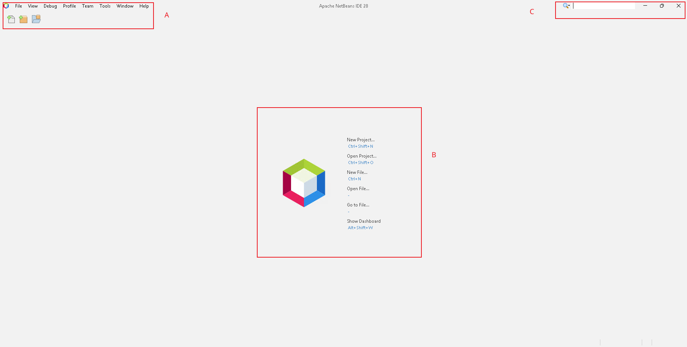
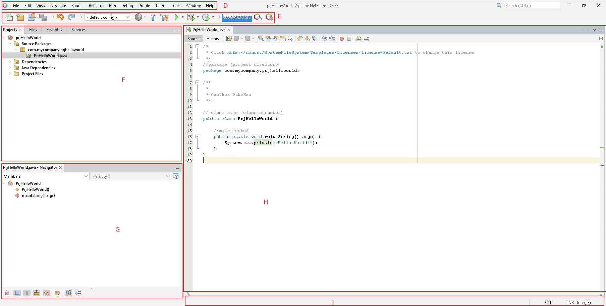
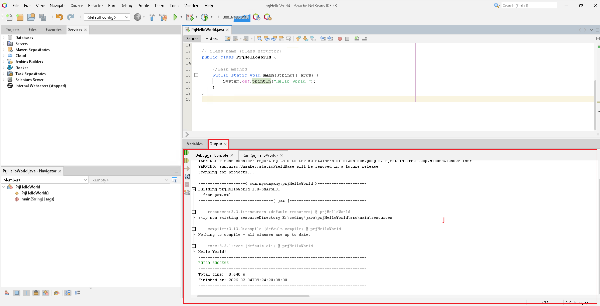
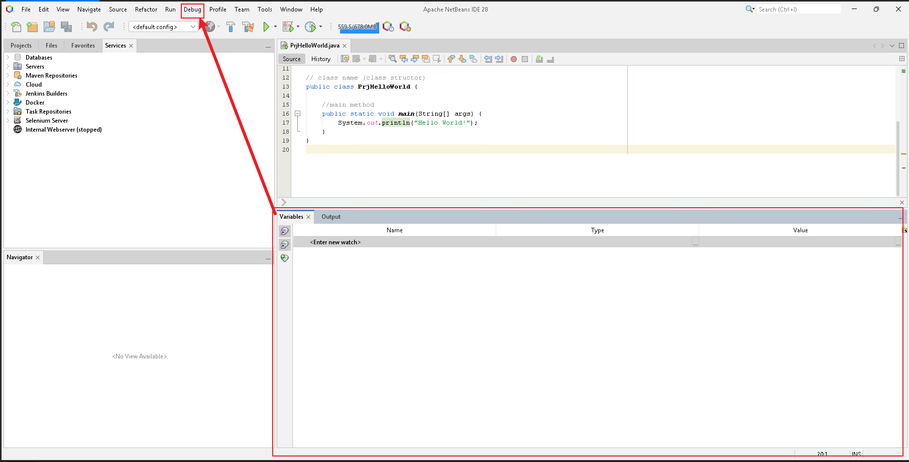
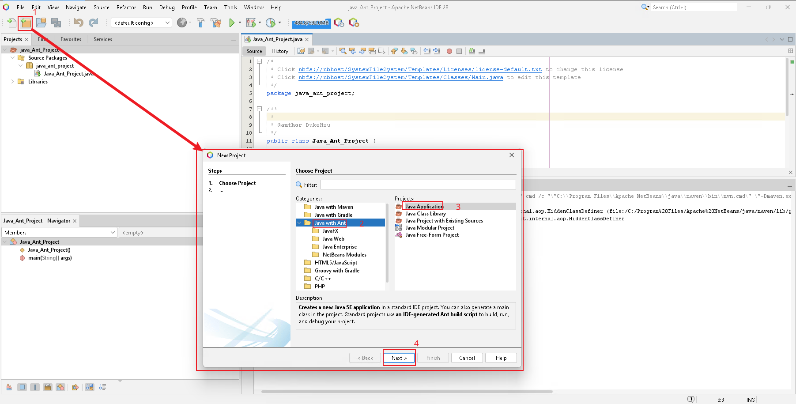

2026-02-04 08:33

Tags: #java 
Made by Duke Hsu

---
## Topic outline Part - 1
1. Introduction Netbeans IDE
2. Netbeans Installing 
3. Netbeans basic use guide (How to make a New Project)
4. Program Structure in Netbeans
5. Basic Programming  Rules in Java
6. Creating Class 

### Introduction Netbeans IDE

Apache NetBeans is a free, open-source Integrated Development Enviroment (IDE) used to write , edit, compile, debug, and run programs, especially in java.

NetBeans combines:
- Code editor
- Compiler support
- Debugger
- Project management tools
- More programming language support 

## Install NetBeans

Apache NetBeans 28 

Download: 
https://netbeans.apache.org/front/main/download/

https://www.codelerity.com/netbeans/
## NetBeans Basic Use guid

### Interface 

NOTE: A - K is refers to interface annotation





A -  Menu Bar : Provides access to all NetBeans commands.

B - NetBeans Initial interface

C - Menu Bar: Search

D - Menu Bar: Provides access to all NetBeans commands.

E - Toolbar: Provides quick-access buttons for command actions 

F - Projects Windows:  Displays all projects and their structure
	- Labs  in Project Windows : 
		-  File ,Favorites  : Provides quick access buttons for common actions
		- Services : Used mainly for database and enterprise applications 

G - Navigator Window: Provides a structural view of the current file / methods 

H - Code Editor Window: Where you write , and view source code . 

I - Status Bar: Located at the bottom of the IDE . Shows information such as current line number, file status , and notifications . 

 



J - Output Window : Displays program output , compilation results, and error messages. 

K - Debugging Window: Appears when debugging a program. Shows breakpoints , call stack, and variable values (MENU BAR -> Debug - New Watch)


## How to make a New Project 



1. Click File Menu > New Project from the Menu Bar or press short key "Ctrl + Shift + N"  to create a new project 
2. Choose Java Application (java with Ant)
3.  Class name / meaning full the project name /  location/ 

## Program Structure 
```java
/*
 * sample multiline comments
 * Click nbfs://nbhost/SystemFileSystem/Templates/Licenses/license-default.txt to change this license
 * Click nbfs://nbhost/SystemFileSystem/Templates/Classes/Main.java to edit this template
 */

//Package
package java_ant_project;

/**
 *
 * @author dukehsu
 */

//Main Class 
public class Java_ant_Project {
    //Class attributes 
    
    
    /**
     * @param args the command line arguments
     */
    
    //main method (programing enter point)
    public static void main(String[] args) {
        // TODO code application logic here
        
        System.out.println("Hello World"); //out put "Hello World"
    }
    
}
```

## Basic Programming  Rules in Java 

1. Java Is Case-Sensitive
2. Every Java Program starts with a Class
3. The main() Method Is the Entry Point
4. Statements Must End with a Semicolon`;`
5. Curly Braces `{}` Define Code Blocks 
6. Class Names Must Match File Names
7. Variables Must Be Declared Before Use
8. Use Proper Naming Conventions
9. Use the Correct Data Type
10. Comments Improve Code Readability 


| Element  | Conventi   | Example   |
| -------- | ---------- | --------- |
| Class    | PascalCase | FirstName |
| Variable | camelCase  | lastName  |
| Method   | camelCase  | myTools   |


----

## References:  

Module 2 - PPT 
