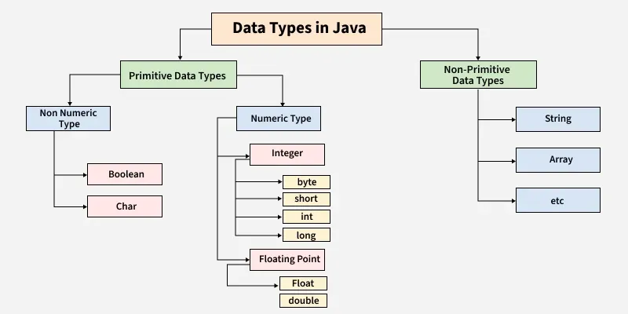

#Module 3 - Java Basics
---

2026-02-26 16:01

Tags: #java 

Author:  Duke Hsu

---
Module 3 - Java Basics

## Module Topic 

Data Types

- Variables 
- Data Types
- Constants

Operators and Expressions

-  + - * / .....


Scanner

- Input 
- Output
- nextLine()

Example Application in OOP 


### Datatypes and Variables and Constants

Concept Define

 - **Variables** are named memory locations used to store data that can change during program execution.

 - **Data Types** define the type and size of data a variable can store.

 - **Constants** are values that cannot be changed once assigned . In Java, constants are declared using the `final` keyword.




#### Primitive Data Types in Java

| DATA TYPE | DESCRIPTION                        | EXAMPLE                       | DEFAULT VALUE (FOR FIELDS)|
| --------- | ---------------------------------- | ----------------------------- | -------------------------- |
| byte      | very small whole numbers           | `byte b = 10;`                | 0                          |
| short     | small whole numbers                | `short  s = 100;`             | 0                          |
| int       | whole numbers                      | `int age = 18;`               | 0                          |
| long      | very large whole numbers           | `long follows = 9888222333L;` | 0L                         |
| float     | decimal numbers(single precision)  | `float price = 99.5f`         | 0.0f                       |
| double    | decimal numbers (double precision) | `double salary = 25000.78;`   | 0.0d                       |
| char      | a single charater                  | `char grade ='A';`            | '\u0000'                   |
| boolean   | true of false values               | `boolean  isPassed = true;`   | false                      |


!!!note
	String  or any Object default values  is `NULL`


### Operators

1. Arithmetic Operators

	- Used to perform mathematical operations.

2. Assignment Operators

	- Used to assign values to variables

3. Relational (Comparison ) Operators

	- Used to compare two values and return a boolean result 
	
4. Logical Operators

	-  Used to  combine of negate boolean conditions, allowing for complex decision-making in control flow statements. 

5. Unary Operators

	-  Unary operators in java perform operations on a single operand. They include operations like` negation(-)`,` increment(++)`, and `decrement(--),` allowing for modifications or evaluations of a single value.

6. Ternary(Conditional ) Operator

	- The ternary operator in java is a concise way to evaluate a condition and return one of two values based on that condition. It uses the syntax` condition ? valueIfTrue : valueIfFalse,` enabling shorthand conditional expressions. 


#### Tables and Example 

Arithmetic 

| OPERATOR | DESCRIPTION             | EXAMPLE |
| -------- | ----------------------- | ------- |
| +        | addition                | a + b   |
| -        | subtraction             | a - b   |
| /        | division                | a  / b  |
| %        | modulus(remainder onec) | b % a   |
| *        | multiplication          | a * b   |

Assignment 

| OPERATOR | EXAMPLE | MEANING       |
| -------- | ------- | ------------- |
| =        | x = 5   | assign 5 to x |
| +=       | x += 2  | x = x + 2     |
| -=       | x -= 1  | x = x - 1     |
| *=       | x *= 3  | x = x * 3     |
| /=       | x /= 2  | x = x / 2     |


Relational (Comparison) 

| OPERATOR | DESCRIPTION              | EXAMPLE |
| -------- | ------------------------ | ------- |
| ==       | equal to                 | x == y  |
| !=       | not equal tp             | x != y  |
| >        | greater than             | a  > b  |
| <        | less than                | b < a   |
| >=       | greater than or equal to | c >= b  |
| <=       | less than or equal to    | c <= a  |


Logical Operators

| OPERATOR | DESCRIPTION | RETURN                     |
| -------- | ----------- | -------------------------- |
| &&       | AND         | all true return true       |
| \|\|     | OR          | if one is true , then true |
| !        | NOT         |  true  / false             |


Unary Operators 

| OPERATOR | DESCRIPTION                 | RETURN                                                                           |
| -------- | --------------------------- | -------------------------------------------------------------------------------- |
| +        | Unary plus operator         | indicatespositive value (numbers are <br>        positive without this, however) |
| -        | Unary minus operator        | negates an expression                                                            |
| ++       | Increment operator          | Increments a value by 1 (遞增)                                                     |
| --       | Decrement operator          | decrements a value by 1 (遞減)                                                     |
| !        | Logical complement operator | inverts the value of a boolean(反轉)                                               |

```java
int a = 5;
int nagetiveA = -a;  //nagetiveA output -5 unary minus operator

int b = -5;
int B = +b;  // B out put -5 , unary plus operator ,

int c = 6;
c++; //c is 7

int d = 10;
d--;  // d is 9

boolean trueThings = false;
boolean notrue = !trueThings; //'nottrue' is now true

```


Ternary (Conditional) Operator

Syntax: `condition ? valueTrue : valueFalse`

```java
int age = 18;

String status = (age>=18)? "Adult" : "Minor"; // true , output adult
```

More Operator plz check : [https://docs.oracle.com/javase/tutorial/java/nutsandbolts/opsummary.html](https://docs.oracle.com/javase/tutorial/java/nutsandbolts/opsummary.html)


Order of Precedence(Highest to Lowest)


| PRECEDENCE LEVEL | OPERATORS            | OPERATOR CATEGORY       |
| ---------------- | -------------------- | ----------------------- |
| 1 (Highest)      | ()                   |                         |
| 2                | ++, --,!             | Unary Operators         |
| 3                | *, /, %              | Arithmetic              |
| 4                | < , > ,<=, >=        | Relational (Comparison) |
| 5                | == , !=              | Relational (Comparison) |
| 6                | &&                   | Logical Operators       |
| 7                | `                    |                         |
| 8                | = , +=, -= , *= , /= | Assignment              |


### Input and Output Using Scanner

#### The Scanner Class

- The Scanner class is part of the java.util package, and allows programs to accept input from users.

Common Scanner Methods.

- `nextlnt()` : Reads the next integer input from the user. For example, if the user enters "42", it stores **42** as an integer.

- `nextDouble()`:  Reads the next double (decimal) number input. For instance, if the user enters "3.14", it stores **3.14** as a double.

- `nextLine()`:  Reads an entire line of text input, including spaces, until the user presses Enter. For example, if the user enters "Hello World", it stores **"Hello World"** as a string.

- `nextBoolean()`: Reads the next input value as a boolean (true or false). If the user types "true" or "false", it stores that value as a boolean.

- `next()`: Reads the next token (word) until white space.


----
### References

Module 3 - OOP Java Basics.pdf


Summary of Operators - [https://docs.oracle.com/javase/tutorial/java/nutsandbolts/opsummary.html](https://docs.oracle.com/javase/tutorial/java/nutsandbolts/opsummary.html)

Scanner - java platform -[https://docs.oracle.com/javase/8/docs/api/java/util/Scanner.html](https://docs.oracle.com/javase/8/docs/api/java/util/Scanner.html)

Java Data Types - [https://www.geeksforgeeks.org/java/java-data-types/](https://www.geeksforgeeks.org/java/java-data-types/)
