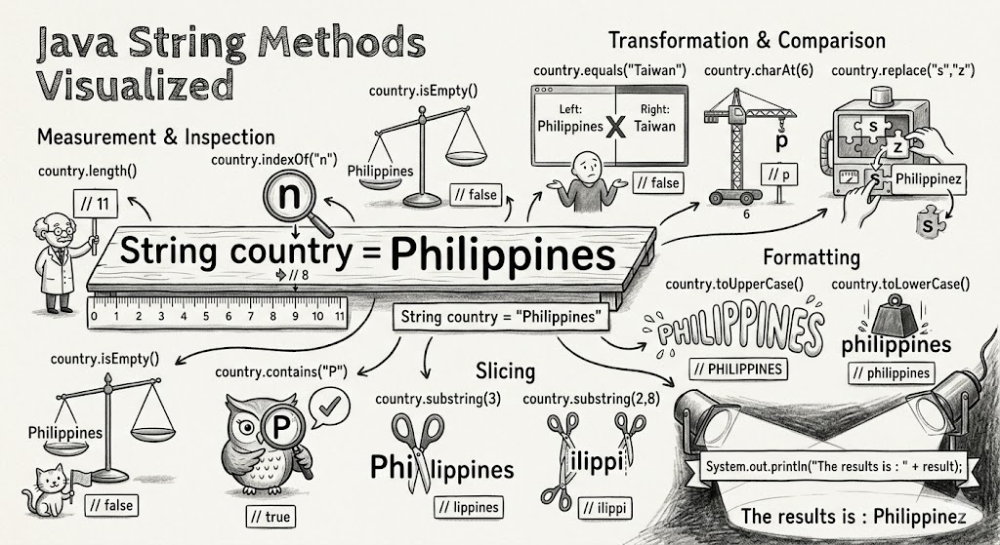

# Module - 6 Arrays and String Part 2

2026-03-31 17:26

Tags: #java 

Author:  Duke Hsu

---

## String Method 

- The String class has a set of built-in methods that you can use on strings. 
- In java ,Strings are immutable
- In java, a string is a sequence of characters
- Every character in a string has an index starting from 0 
- A string can be treated as an array of characters. 

## Key  String Methods


| Method                           | Description                                                                                                 | Return Data Type | Note                     |
| -------------------------------- | ----------------------------------------------------------------------------------------------------------- | ---------------- | ------------------------ |
| length();                        | return characters size                                                                                      | int              |                          |
| toUpperCase();                   | return characters in all CAPS                                                                               | String           |                          |
| toLowerCase();                   | return characters in all lowercase                                                                          | String           |                          |
| chartAt();                       | return the character of the specified (position)                                                            | char             |                          |
| codePointAt();                   | Returns the Unicode of the character at the specified index                                                 | int              |                          |
| codePointCount();                | Returns the number of Unicode values found in a string.                                                     | int              |                          |
| substring(startIdex);            | Returns a new string which is the substring of a specified string                                           | String           | argument datatype is int |
| substring(startIndex, endIndex); | Returns a new string which is the substring of a specified string                                           | String           | argument datatype is int |
| equals();                        | compare tow string  equal or not `true` or `false`                                                          | boolean          | case sensitive           |
| contains();                      | check whether a string contains a sequence of characters                                                    | boolean          |                          |
| replace();                       | Searches a string for a specified value, and returns a new string where the specified values are replaced   | String           |                          |
| replaceAll();                    | Replaces each substring of this string that matches the given regular expression with the given replacement | String           | regex                    |
| isEmpty();                       | Checks whether a string is empty or not .                                                                   | boolean          |                          |
|                                  |                                                                                                             |                  |                          |

## Code Example




```java
package javaString;
public class Main {
	public static void main(String[] args) {
		
		 	String country = "Philippines";
		    
		    boolean result = country.equals("Taiwan"); //false
		 	int result = country.length(); //11
		 	char result = country.charAt(6); //p
		 	int result = country.indexOf("n"); //8
		 	boolean result = country.isEmpty();//false
		 	String result = country.toUpperCase(); //PHILIPPINES
		 	String result = country.toLowerCase(); //philippines
		 	String result = country.substring(3); //lippines
		 	String result = country.substring(2,8); //ilippi
		 	boolean result = country.contains("P"); //true
		 	String result = country.replace("s", "z"); //Philippinez
		    
		    System.out.println("The reults is :  "+ result);
		
		
	}

}

```


----
### References

[https://www.w3schools.com/java/java_ref_string.asp](https://www.w3schools.com/java/java_ref_string.asp)

