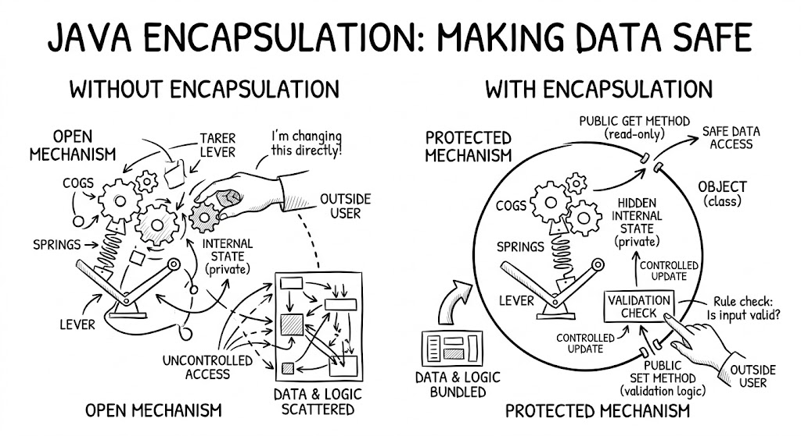

# Module  7  Encapsulation

2026-04-21 12:11

Tags:  #java 

Author:  Duke Hsu

---





### 1.0 Key concepts 

- Encapsulation is wrapping data and methods together, hiding the internal details, and only showing what is needed to the outside world. 

- That meaning of Encapsulation , is to make sure that "sensitive" data is hidden from users. 

- To achieve this ,you must : declare class variables / attributes as `private`

- Provide `publi` get and set  methods to access and update the value of a `private ` variable 


### 1. 1 Types of Access Modifiers 

- Access Modifiers: Control visibility and accessibility of classes, attributes. ,methods, and constructors. (control the access level)

- Non- Access Modifiers:  do not control access level, but provides other functionality 

 - [https://www.w3schools.com/java/java_non_modifiers.asp](https://www.w3schools.com/java/java_non_modifiers.asp)


|           | Same Class | Same Package | Sub Class | Other Packages |     |
| --------- | ---------- | ------------ | --------- | -------------- | --- |
| public    | &check;    | &check;      | &check;   | &check;        |     |
| private   | &check;    | &#10007;     | &#10007;  | &#10007;       |     |
| protected | &check;    | &check;      | &check;   | &#10007;       |     |
| default   | &check;    | &check;      | &#10007;  | &#10007;       |     |


### 1.2 Encapsulation and Data Handling 

Encapsulation is the practice of bundling data (variables) and methods together, while hiding the internal data from direct access.

-  We use methods (such as getters and setters) to read or update the data.
- The main purpose is to keep the data safe, controlled, and organized, preventing invalid changes and making the code easier to maintain.

Bank account Example: 

```java
class BankAccount {
    // 1.  private 
    private String accountNumber;
    private double balance;

    // 2. constuctor 
    public BankAccount(String accountNumber, double initialBalance) {
        this.accountNumber = accountNumber;
        if (initialBalance >= 0) {
            this.balance = initialBalance;
        }
    }

    // 3. public get
    public String getAccountNumber() {
        return accountNumber;
    }

    public double getBalance() {
        return balance;
    }

    // Deposits - Controlled Data Processing
    public void deposit(double amount) {
        if (amount > 0) {
            balance += amount;
            System.out.println("存款 $" + amount + " 成功");
        } else {
            System.out.println("存款金額必須大於 0");
        }
    }

    // Withdrawal - Includes verification logic
    public boolean withdraw(double amount) {
        if (amount > 0 && balance >= amount) {
            balance -= amount;
            System.out.println("提款 $" + amount + " 成功");
            return true;
        } else {
            System.out.println("提款失敗：餘額不足或金額錯誤");
            return false;
        }
    }
}

public class Main {
    public static void main(String[] args) {
        BankAccount myAccount = new BankAccount("A123456", 5000);

        myAccount.deposit(3000);
        myAccount.withdraw(2000);
        
        System.out.println("目前餘額：" + myAccount.getBalance());
        
        // myAccount.balance = -100000;  // Compilation error! Cannot be directly modified.
    }
}
```


###  1.3 Getter and Setter Methods

- We use methods (such as getters and setters) to read or update the data.

Code Example:

```java
public class Car {  
    private String make; // private  = restricted access  
    private String model;  
    private int year;  
  
    //constructor  
    Car(String make, String model, int year){  
        this.setMake(make);  
        this.setModel(model);  
        this.setYear(year);  
    }  
  
    // get method - return values  
    public String getMake(){  
        return  make;  
    }  
  
    public  String getModel(){  
        return model;  
    }  
  
    public  int getYear(){  
        return year;  
    }  
  
  
    //set method - set  
    public void setMake(String make){  
        this.make = make;  
    }  
  
    public void setModel(String model){  
        this.model = model;  
    }  
  
    public  void  setYear(int year){  
        this.year  = year;  
    }  
}

// main method

public class Main{  
    public static void main(String[] args){  
        Car honda = new Car("Honda","Click",2015);  
  
        //use get read data  
        System.out.println(honda.getMake());  
  
        //use set update data  
        honda.setYear(2022);  
  
        System.out.println(honda.getYear()); //out put 2022  
  
    }  
}

```
 


### 1.4 Using the `this` Keyword 

- Within an instance method or a constructor , this is a reference to the current object, the object whose method or constructor is being called. You can refer to any member of the current object from within an instance method or a constructor by using this .
- TH most common reason for using the this keyword is because a field is shadowed by a method or constructor parameter. 

Code Example: 

```java
public class Rectangle {
    private int x, y;
    private int width, height;
        
    public Rectangle() {
        this(0, 0, 1, 1);
    }
    public Rectangle(int width, int height) {
        this(0, 0, width, height);
    }
    public Rectangle(int x, int y, int width, int height) {
        this.x = x;
        this.y = y;
        this.width = width;
        this.height = height;
    }
 
}
```

[https://docs.oracle.com/javase/tutorial/java/javaOO/thiskey.html](https://docs.oracle.com/javase/tutorial/java/javaOO/thiskey.html)

### 1.5 Encapsulation for Class Design 

- Use `private` attributes to hide data inside the class.
- Provide controlled access through public methods (`getters and setters`).
- Avoid direct public variables to prevent unwanted changes.
- Add validation and rules inside methods to keep data safe and consistent.
- Make the class easier to understand and maintain by organizing data and behavior together.


## 1.6 Why Encapsulation is important in Java?

#### 1.6.1  Keep data safe

- It hides important data inside the class (using `private`). Other people cannot change the data directly. They can only use safe methods (like `deposit() `or `setAge()`).
- Therefore No more negative age or negative bank balance by mistake.

####  1.6.2 Control how data is changed

-  You can add rules inside the methods
- Example : Only allow deposit if `amount > 0 `
- Data always stays valid and correct.


#### 1.6.3 Makes code easier to maintain

- If you change the inside logical  later, other parts of the program don't break.
- The outside only sees the "buttons"(methods), not the complicated inside.

#### 1.6.4 Reduces bugs

- When many people work on the same project, encapsulation stops them from accidentally breaking each other's code. 

#### 1.6.5 Organizes your code better

- Data and Method that work on that data stay together in one place.
- Clean and neat. 


----
## References

[https://docs.oracle.com/javase/tutorial/java/javaOO/thiskey.html](https://docs.oracle.com/javase/tutorial/java/javaOO/thiskey.html)  -  Using the this Keyword  - Oracle