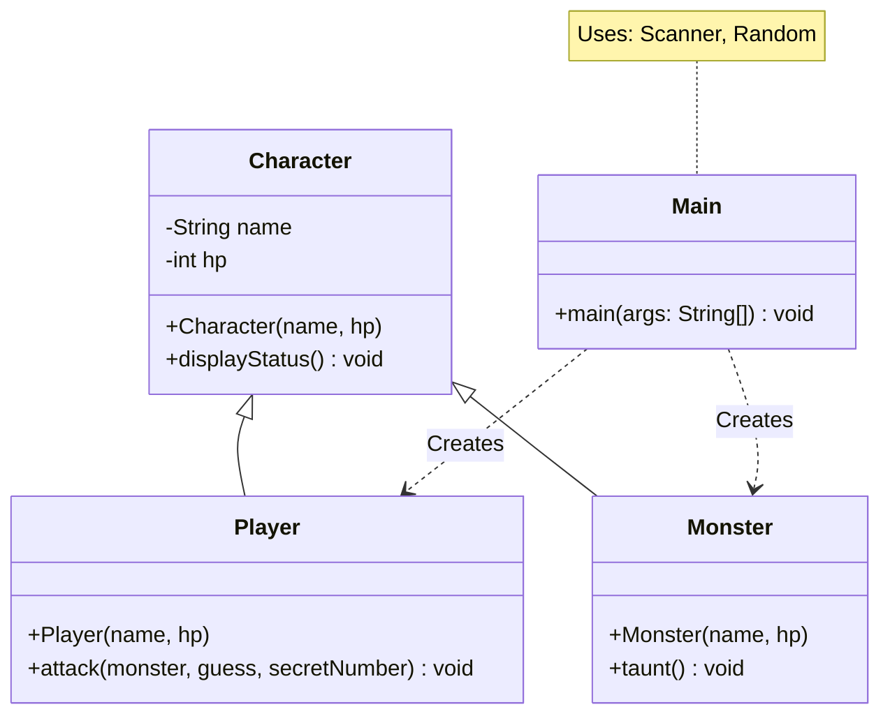
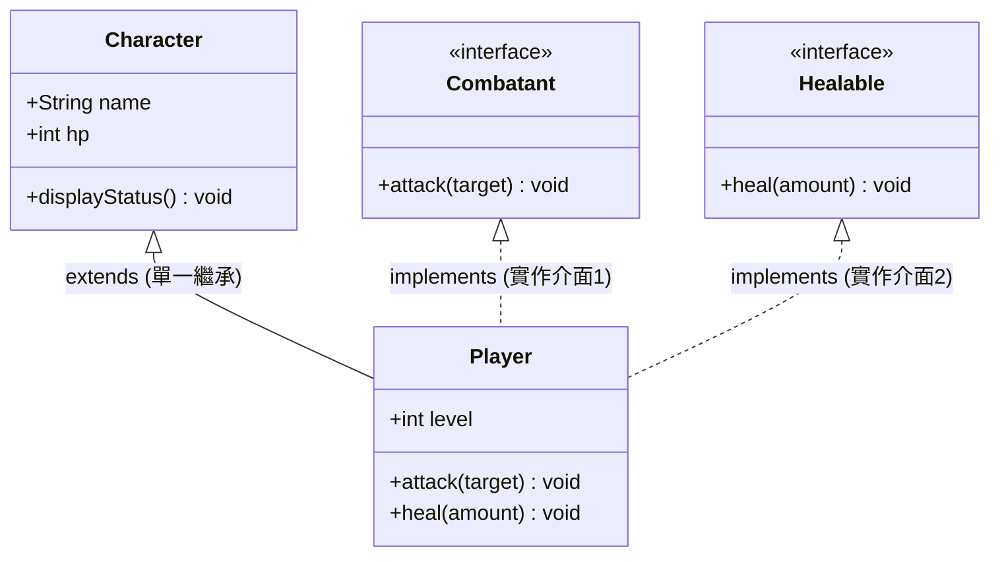
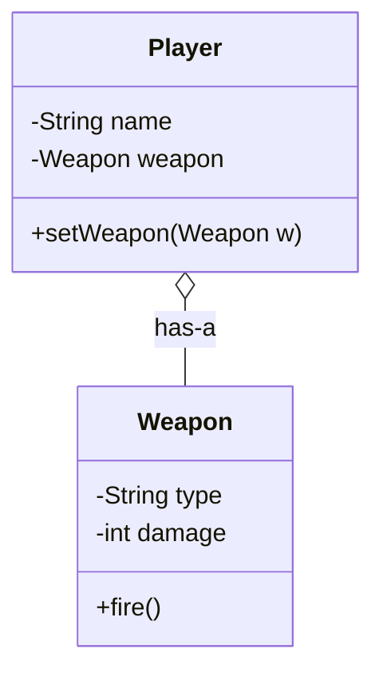

# Module   8 Inheritance

2026-04-23 12:02

Tags:  #java 

Author:  Duke Hsu

---

## 1 - Key Concepts

### 1.1 Inheritance definition 

**Concept:**

Inheritance is a mechanism where one class (Subclass) acquires the properties and behaviors (fields and methods) of another class (Superclass). Think of it as a "genetic" transfer of code.

•	Superclass (Parent): The class being inherited from.
•	Subclass (Child): The class that inherits from the parent.
•	Keyword: We use `extends` to create this link.
•	Relationship: It follows the `is-a `rule (e.g., a Dog is-a Animal).

**Code Example:** 

```java

//Parent class
class Animal{
	void eat(){
		
		System.out.println("This animal is eating.");
	
	}
}

//Child class inherits from Animal
class Dog extends Animal{
	void bark(){
		System.out.println("Woof! Woof!!")
	}
}

```


Class note

	Inheritance  allows one class to acquire the properties and methods of another class. 
	Supper class and subclass.   Inheritance in Taglog  = mana


### 1.2  Using `extends` Keyword

**Concept:**

The  extends keyword is used to inherit from a parent class. 
We use `extends` to create this link.


**Code Example:** 

```java

//Parent class
class Animal{
	void eat(){
		
		System.out.println("This animal is eating.");
	
	}
}

//Child class inherits from Animal
class Dog extends Animal{
	void bark(){
		System.out.println("Woof! Woof!!")
	}
}
```


### 1.3 Method Overriding

**Concept:**  

Method Overriding occurs when a subclass provides a specific implementation for a method that is already defined in its parent class. The method signature (name and parameters) must be exactly the same.  

- **Why use it?** To allow a child class to behave differently while using the same method name.


**Code Example:** 

```java
class Animal {
    void makeSound() {
        System.out.println("Generic animal sound");
    }
}

class Dog extends Animal {
    @Override // Good practice to use this annotation
    void makeSound() {
        System.out.println("Bark!"); // Overriding the parent's method
    }
}
```


**Class note:**

	Method overriding allows a child class to provide its own version of a parent method 
	

### 1.4  The  `super` Keyword

**Concept:**

The `super`  keyword is a reference variable used to refer to immediate parent class objects. It acts as a bridge to reach the "hidden" or "original" parts of the parent class. 

Common uses:

1. `super()`: Calls the parent's constructor
2. `super.method()`: Calls a method in the parent class that might have been overridden in the child .

**Code Example:**

```java

//super class
class Character{
	String name;
	Character(String name){
		this.name = name;
	
	}
}


//child class
class Player extends Character{
	int health;
	Palyer(String name , int health){
		super(name); //use super to pass 'name' to the Character constructor
		this.health = health;
		
	}
}
```


**Class note:**

	`super `refers to the parent class object. 
	
	Uses 
	- Call parent constructor
	- Access parent methods
	- Access parent variables


### 1.5 `Is-A` Relationship

**Concept:**

- Inheritance follows the `Is-A` relationship

**Example:**

Dog `Is-A` Animal
Student `Is-A` Person


Class diagram symbol for inheritance  

- UML Symbol:  `Child -----> Parent`

Example UML with `Is-A` Relationship 




**Interface** 




#### 1.5.1 `Has-A ` Relationship

**Concept:** 

In Java, a `Has-A` relationship is also known as Association. It occurs when one class uses another class as a member variable . Unlike `Is-A` (Inheritance) , which focuses on hierarchy,  `Has-A`  focuses on Code Reusability and Modularity.

**Types of Has-A relationship** 

There are two main ways to implement a Has-A relationship, based on how strongly the objects are tied together:

A. Aggregation ( Weak Association)

The child object can exist independently of the parent. 

- Real-world Example: A school has Students. If the school closes, the students still exist
- UML  Symbol: Empty diamond (‬‭‬‬‭‬‬‭‬‬‭‬ $\diamond \text{---}$  ) ‬‭‬‬‭‬

B. Composition (Strong Association)

The child object cannot exist without  the parent. It represents a "death relationship ".

- Real-world Example: A human has a Heart. If the human dies, the heart (in a functional sense) ceases to function within that context.
- UML Symbol: Filled diamond  ($\blacklozenge \text{---}$)

**Why use `Has-A`**


- Flexibility: You can changer the behavior of a class at runtime by swapping the internal object. 
- Low Coupling: Classes remain independent. A change in the Engine class doesn't necessarily force a rewrite of the Car class. 
- Maintenance: Smaller, focused classes are easier to debug than one giant inherited tree. 


**UML**




**Code Example:** 

```java
// 被擁有的類別
class Weapon {
    String name = "基礎長劍";
    int damage = 10;
}

// 擁有的類別 (Has-A)
class Player {
    String name;
    // 這就是 Has-A：Player 擁有一個 Weapon 類別的引用
    Weapon myWeapon; 

    Player(String name) {
        this.name = name;
        this.myWeapon = new Weapon(); // 在初始化時建立關聯
    }

    void attack() {
        System.out.println(name + " 使用 " + myWeapon.name + " 造成了 " + myWeapon.damage + " 點傷害");
    }
}
```


**Summary Table**

|Feature|Is-A (Inheritance)|Has-A (Association)|
|---|---|---|
|Keyword|extends|new ClassName()|
|Relationship|Tight Coupling|Loose Coupling|
|Meaning|A subclass is a specialized version of a superclass.|A class owns or uses another class.|
|Design Rule|Use for "Type" hierarchy.|Use for "Features/Components."|

!!! note "Tips"
	**Design Principle:** Always "Favor Composition over Inheritance." If you can achieve a feature by including an object rather than inheriting from it, choose composition for better long-term scalability.

### 1.6 Designing Class  Hierarchies 

Proper hierarchy improves reusability .

**Concept:** 

Designing a hierarchy means organizing classes from most general to most specific .  In UML diagrams, an arrow points from the Child to the Parent to represent inheritance. 

### Summary Table:

|Term|Simple Definition|Key Requirement|
|---|---|---|
|Inheritance|Reusing code from another class.|Uses extends.|
|Overriding|Redefining a parent's method in the child.|Same name, same parameters.|
|Overloading|Creating multiple methods with the same name.|Same name, different parameters.|
|super|Accessing parent class members.|Used inside the subclass.|


----
## References

Class 