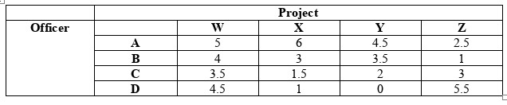
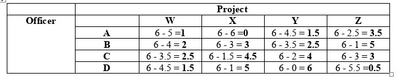
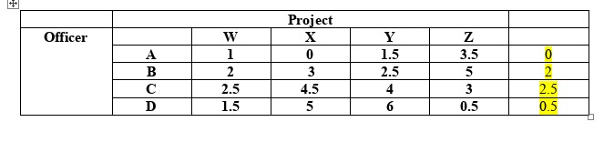
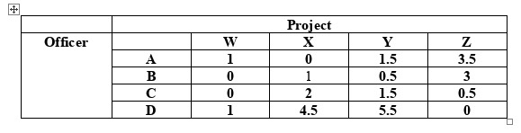
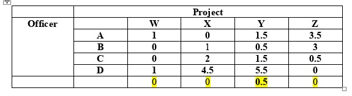
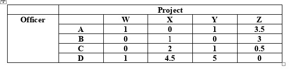
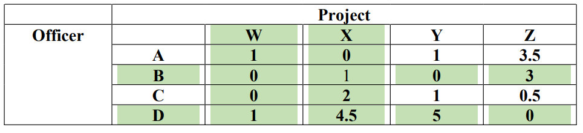
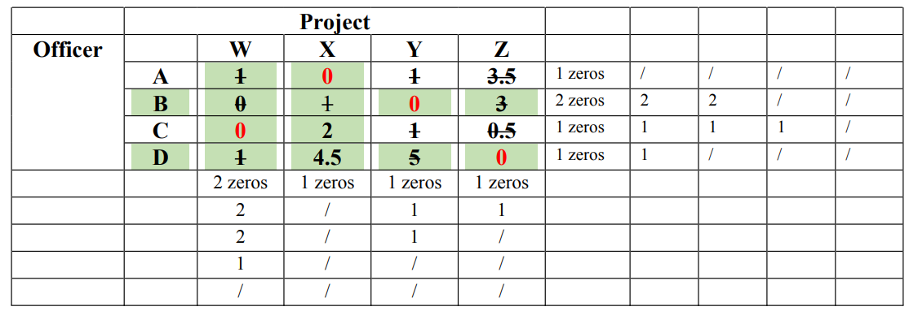

# Activity  Assignment Model  Maximum Problem

2026-04-10 11:25

Tags:  #math 

Author:  Duke Hsu

---

**Activity: Assignment Model**  
**Problem:**  
   
A Faculty Association of a certain college has four fund raising projects to work, which are to be assigned to each of the four officers. Given the **opportunity profit**( in thousand pesos) table below. What should be the best assignments?  
   
==Opportunity profit = Maximum profit==  

!!! note "Maximization"
	The Hungarian Method was originally designed to solve minimization problems. Therefore, "Step 0: Building the Loss Matrix" must be performed first before proceeding.

### **Step 0: Loss Matrix / Regret**  
  
Loss Matrix = Maximum value – Each cell values  
  
Max value is **6**  

### **Step 1: Row Reduction**  
Find minimum value in each row. Subtract that value from each value in the same row .  

Iteration **a** 

### **Step 2: Column  Reduction**  
Find minimum value in each column . Subtract that value from each value in the same column.  

Iteration **b**   

### **Step 3 - Cover All Zeros with Lines**  
Draw the minimum number of lines needed to cover all zeros. If number of lines = number of rows, you are done . Otherwise move to step 4 .  

   

  
**4 Lines = 4 Rows  We are done .  Jump to Step 5**  
  
### **Step 4:  Revise the Matrix**  
Find the smallest uncovered values. Subtract this from all uncovered values and add it to values at intersection of lines. Then repeat step 3.  
- Cells with **no line** through them: subtract the smallest uncovered number  
- Cells at the **crossing point** of two lines: add the smallest uncovered number  
- Cells with **exactly one line**: keep the number as it is  
### **Step 5:  Circle the assignment from row or column with minimum number of zeros**  

### **The Assignments:**  
   
**Officer A to project X            6**  
**Officer B to project Y            3.5**  
**Officer C to project W            3.5**  
**Officer D to project Z            5.5**  
   
**Maximum Profit is : 6+3.5+3.5+5.5 = 18.5**  
   
**18, 500.00 Pesos**  
   

----
   

   
   
