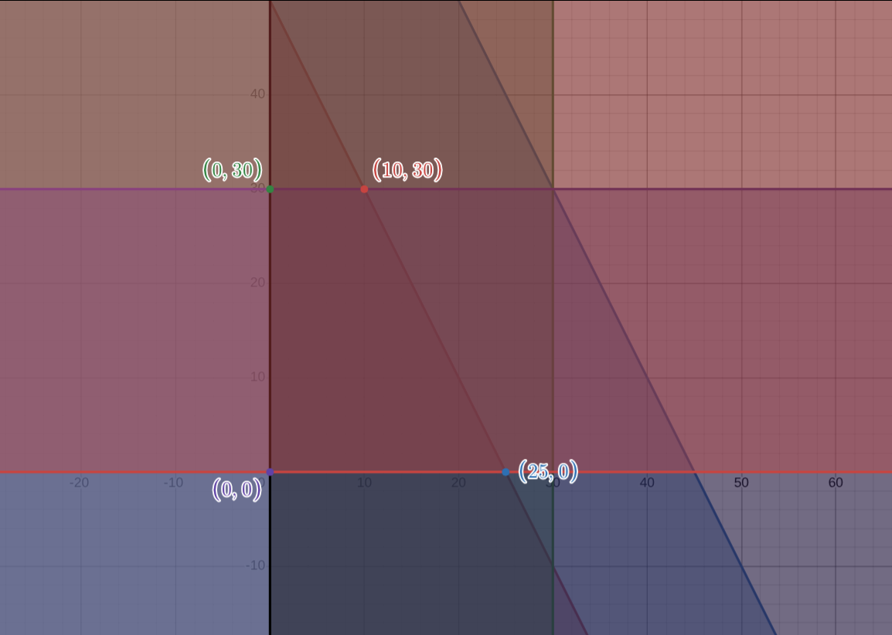

2026-02-09 09:10

Tags: #math 
Author:  Duke Hsu

---
Linear Programming Problem by Graphing Method

## Solution Step 
### I  - Decision Variable

Let  
	`x= basket flower`
	`y= bouquet flower`

Find 2 variables in a given problem

### II - Create a Table

For example: 

|          | x   | y   |              |
| -------- | --- | --- | ------------ |
| flower   | 24  | 12  | <=600        |
| ribbon   | 2   | 1   | <=90         |
| basket   | 1   | -   | <=30         |
| wrappers | -   | 2   | <=60         |
| profit   | 900 | 500 | need maximum |

Find the variable data through the given problem, and create a table. 

### III - Linear Programming Problem (LPP) Model

List LPP models via table

Object function

of maximum profit:

$P = 900x + 500y$

of minimum: 

Subject to :

$24x+12y \leq 600$

$2x+y\leq 90$

$x\leq30$

$2y\leq 60$

### IV -  Graphing 

Point A: (0,50), (25,0)
Point B: (0,90),(45,0)
Point C: (30,0)
Point D: (0,30)

### V - Conner Point 
E: (10,30)

Computation:

$P = 24x+ 12y$

$P = 900 \times 10 + 500 \times 30 = 24,000$

### VI - Conclusion

There are for  
 `x=10 basket of flower`

`y=30 bouquet of flower`

----
### References: 
