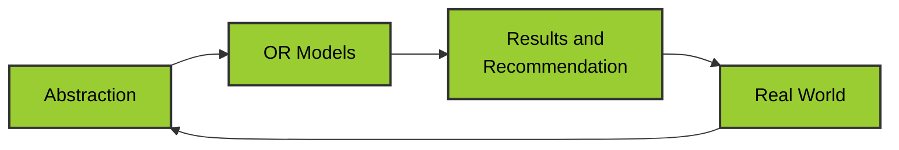

01/23/2026
#QuantitativeMethods

---
## Module 1  Introduction to Operations Research 

note 
### What is Operations Research (OR)?
Operations Research /Management Science is the application of scientific methods, techniques, and tools to problems involving the operation of systems so as to provide those in control of the operations with optimum, or practically optimum, solutions to the problems. 

Operations Research 通過科學方法，技術，工具應用於涉及系統運作的問題為運營控制者提供最優或最實際的解決方案。 

- National Research Council in Great Britain defines"The application of the scientific method to the study of the operations of large, complex organizations or activities"
- Operation Research is typically used to denote the study and development of the mathematics that underlie the techniques. 
### Development of Operations Research 
- History 
	- WWII: England  - Tactical problems  associated with air and land defense of the Country / Determine the most effective utilization of limited military resources. / From military operations.
	- 從英國的軍事運用轉換到商業運用 / 英國軍事 運用 --- 美國商業運用
	- Simplex Method of Liner Programing 
	- **1947 by American mathematician George B. Dantzig**

### Focus of OR study 
- How to allocate scarce / limited resources
- Operations Research is  a decision-making tool an right hands.
- It's can could save an organization a lot of time and resources. 

### Benefits of Operations Research 
1. Provides a systematic and logical approach to decision-making.
2. Helps communication within an organization through consultation with experts in various areas.
3. Permits a thorough analysis of a large number of alternative options. 
4. Enables evaluation of situations involving uncertainty. 
5. Allows decision  makers to judge how much information to gather in a given problem .
6. Increases the effectiveness of the decision.
7. Enables quick identification of the best available solution.
8. Allows quick and inexpensive examination of a large(sometimes infinite) number of alternatives
9. Enables experimentation with different alternatives using models, thus eliminating the cost of making errors while experimenting with reality .

### Limitations of Operations Research 
1. Time-consuming
2. Probable lack of acceptance by decision makers.
3. Assessments of uncertainties are difficult to obtain.
4. Evaluates the decision in terms of a sometimes oversimplified model of reality, possibly leading to erroneous recommendations.
5. Can be expensive to undertake, relative to the size of the problem.
6. Studies may be abandoned for various reasons, resulting in an unproductive expense. 

### Phases of an OR study 

1. Problem Formulation .
2. Construction of the Mathematical Model.
3. Derivation of the Solution.
4. Testing of the Model and the Solution.
5. Establishing Control over the Solution.
6. Implementation of the Final Results .

### Types of Models 
1. Iconic or scale models
2. Analog models
3. Mathematical models 

### Structure of Mathematical Models
 1. **Decision variables and parameters** 
	- Unknowns to be determined from the solution of the model .
	- Example: For this project / tasks , how many worker we need, how much we need to pay . (time , cost, resource)
	- Key words: Unknowns , Parameters
2.  **Structural constraints or restrictions** 
	- To account for the physical limitations of the system, the model must include constraints which limit the decision variables to their feasible values.
	- Example:  FDA verify / BIR / Shipping capacity  / Time limited / Working time 
	- Key words: Constraints 
	Formular：
	$$g_i(X_1,\ldots,X_n)\le b_i, \quad i = 1,2, \ldots  \quad X_i \ge 0$$
	'g_i' is variables,  'i'  is the constraint,  where 'b_i ' is a known constant.
	 某些條件g_i 不能超過已知上限 b_i 

3. **Object function** 
	- This defines the measure of effectiveness of the system as a mathematical function of its decision variables.  Single goal to maximize or minimize .
	- Example:  Minimize Cost / Maximize Profit / Minimize Time
	- Key words: Object  function /  Mathematical function / Decision variables / Single goal
	Formular:
	$$X_0 = f(X1, \ldots X_n)$$
	'X_0 ' is your goal, 'f(x)' is a mathematical formula 

### Operations Research / Operational Research 

- Scientific approach to managerial decision-making 
	1. Characterized by its use of mathematical models. 
	2. Study is undertaken to help in solving a decision problem. - for decision problem

用理性、算數據、做比較的方式，做比較聰明的決定。
- 科學方法 = 數據 / 比較 / 計算 / 推理
- 數學方法 =  把問題轉換成數學公式或者規則 / 錢/ 時間 / 人力/ 成本 / 利潤
### Why do we need Operations Research ?

**When problems:**
- Get Complicated; -  當問題變的複雜
- Involve trading of quantifiable factors; - 當問題涉及可量化的交易 
- Require comparison of qualitative with quantitative measures; - 當問題需要將定性指標與定量指標進行比較
- Involve uncertainties. - 當問題存在不確定性時
That why we need Operations Research .  

> Operations Research is the use of scientific and mathematical methods to help make better decisions, especially when problems are complex, involve trade-offs, and contain uncertainty.

### The Operations Research Process involves an iterative modeling of the real world

1. **Real World** 
	- The problem in our life 
	- Example: Shipping fee / Cost high / Worker 
	- 這些問題都是很複雜 / 亂 / 很多細節
2. **Abstraction** 
	- What is the topic / important 
	- Witch one can be ignore 
	- Example: Money / Time / Worker is important /
	- 抽象化 / 解析問題 / 區分重要和不重要的

3. **Operations Research Models**
	- Mathematical / Data / Logical 

4. **Result & Recommendation** 
	- 通過計算結果與現實世界相比對 / 是否符合事實 / 

**為什麼是迴圈？**
- 結果可能不實際
- 現實會改變
- 有些條件一開始沒有考慮周到
- 要回去調整模型
- 再計算一次
- 再做一次決定
- 再看一次結果
- 所以這是一個循壞的過程。 

### Summary 

 The Operations Research Analyst translates real world problems into models and recommends real world solutions. 
 
![[Pasted image 20260123104050.png]]