2026-02-28 19:11

Tags: #math 
Author:  Duke Hsu

---
## Module 1 Part 2 - Linear Inequalities

### Single Variable 

#### inequality

- inequality: An inequality is like an equation, but instead of an equal sign (=), is has one of these signs:

| SYMBOL | MEANING                  |
| ------ | ------------------------ |
| $<$    | less than                |
| $\le$  | less than or equal to    |
| $>$    | greater than             |
| $\ge$  | greater than or equal to |

#### Graphing 

 - number line 
 
 Example: 
 

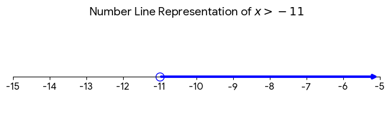

Graphing Rules (number line):

| SYMBOL | CIRCLE | DIRECTION OF ARROW |
| ------ | ------ | ------------------ |
| $<$    | open   | left               |
| $>$    | open   | right              |
| $\le$  | closed | left               |
| $\ge$  | closed | right              |

####  Interval Notation 

| SYMBOL                 | MEANING                   | READING     |
| ---------------------- | ------------------------- | ----------- |
| $(\quad)$              | endpoint **NOT** included | Parentheses |
| $[\quad]$              | endpoint  included        | Brackets    |
| $\infty \quad -\infty$ | always use in parentheses | infinity    |

#### Set Builder Notation 

use curly braces `{ }`

Formart:
${x \quad| \quad condition}$

Meaning:

The set of all $x$ such that the conditions is true .

Example:

$x > 3$,  $\{x | x > 3\}$

---

#### Example

**Question 1:**

$-3x +4 <13$

!!!note
	兩邊都減去4 ， 然後再除以-3
	
	(因為9 除以負數，所以要轉換符號)

$x >-3$  

Step1-Number line 

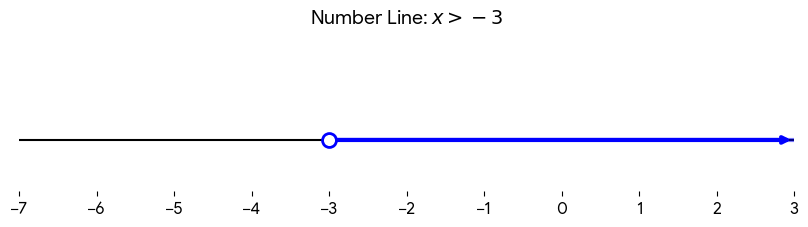

Step2-Interval Notation

$(-3,\infty )$

Step3- Set Builder Notation

$\{x\quad| \quad x > -3 \}$

Value of $x$:  $x=-2,-1,0,1,2,3,4,5...$

---

**Question 2:** 

$-5 \le x \le -1$

Step1 - Number line 
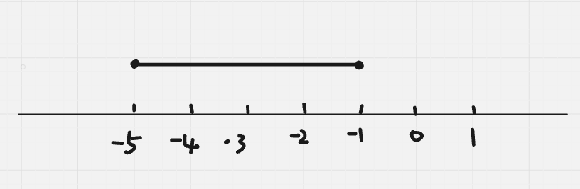

Step2- Interval Notation 

$[-5,-1]$

Step3- Set Builder Notation 

$\{x | -5\le x \le -1\}$

Values of $x$ : $x=-5,-4,-3,-2,-1$

---

**Question 3:**

$x < -3 \quad or \quad x > 3$

Step1 Number line 

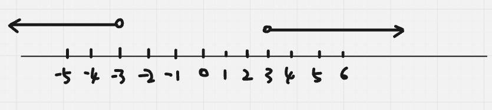

Step2 Interval Notation 

$(- \infty , -3)  \quad (3, \infty)$ 

Step3 Set Builder Notation

$\{x\quad  | \quad x<-3\}\quad  U \quad \{x\quad |\quad  x>3\}$

Vales of $x$: 

$x= -4,-5,-6,-7,-8,-9.....$
$x=4,5,6,7,8,9,10$

---

**Question 4:**

$x\le -5 \quad or\quad  x>10$

Step1 Number line 

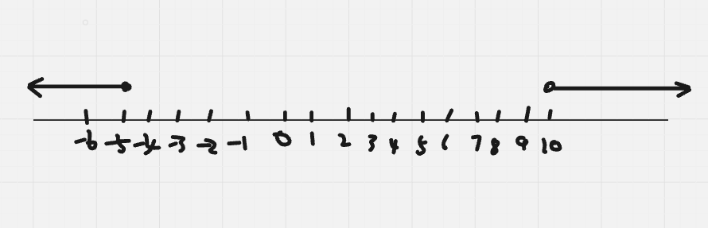

Step2 Interval Notation 

$(-\infty, -5]$  $(10,\infty)$

Step3 Set Builder Notation

$\{x\quad  | \quad x\le-5\}\quad  U \quad \{x\quad |\quad  x>10\}$

Values of $x$: 

$x=-5,-6,-7,-8,....$

$x=11,12,13,14,15$

---

**Question 5:**

$5+x\ge7$ 

$x\ge 2$

Step1 Number line 

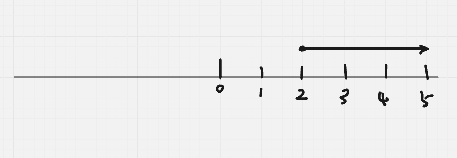

Step2 Interval Notation 

$[2,\infty)$

Step3 Set Builder Notation 

$\{x \quad | \quad x \ge 2\}$

Values of x:   $x=2,3,4,5,6,7,8,9.....$

---

**Question 6:**

$\frac{x}{3} \ge 5$

Multiply both side by : 3 * (x/3) >= 5 * 3

left side x, right side 15, 

Result: $x \ge 15$

Step1: Number line

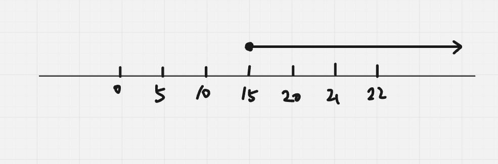

Step2: Interval Notation

$[15, \infty)$

Step3: Set Builder Notation 

$\{x\quad |\quad x \ge15\}$

Values of x:   $x= 15,16,17,18,19,20,21,.....$

----

### Solving it in Two variable 

#### Quadrant Graph

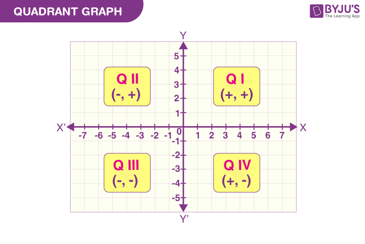

#### Two types of Line 

| LINE NAME   | EXAMPLE  | SYMBOL    |
| ----------- | -------- | --------- |
| Solid line  | -------- | $>,<$     |
| Dotted line | ———      | $\ge,\le$ |

Example:

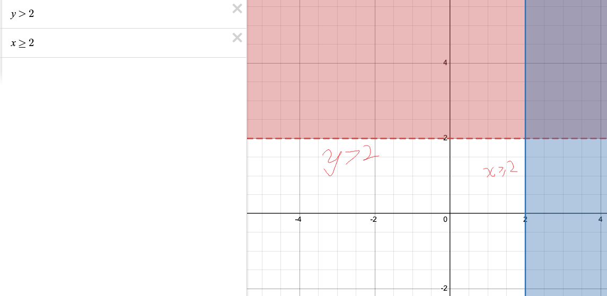

!!!note
	垂直線(Vertical Line)：
	 inequality 中只有x , 沒有y；

!!!note
	水平線 (Horizontal Line):
	inequality 中只有y, 沒有x；

!!!note
	斜線 (Slanted/Oblique Line)
	inequality 中有y，也有x；

#### Graph the inequality 

Question : $3x-5y\ge 15$

Step 1. Replace inequality symbol with equals sign: $3x – 5y = 15$

Step 2. Graph the line

Calculator  the point: 

| x   | y   |
| --- | --- |
| 0   | -3  |
| 5   | 0   |

point A: (0,-3)
point B: (5,0)

Since:   $\ge$  , therefor  is Oblique Line, and in QIV, 

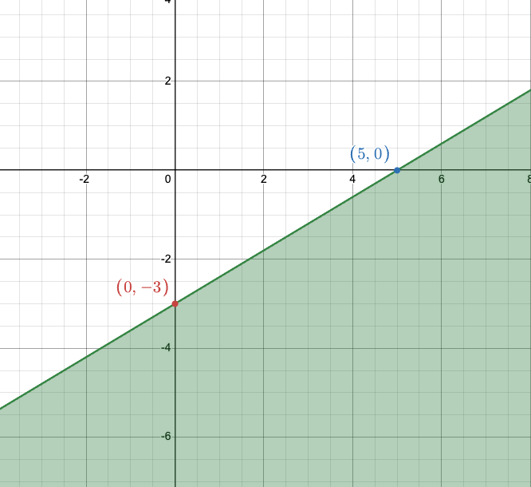

#### 如何判斷二元一次不等式的區域（Range） （如何畫出陰影）

當你畫出一條直線（例如 $2x + 4y = 8$）後，這條線把坐標平面分成了兩半。要判斷該塗哪一邊，最簡單的方法是**「原點測試法」**。

- **式子：** $2x + 4y \leq 8$
    
- **步驟：**
    
    1. 先畫出直線 $2x + 4y = 8$（通過 $(4, 0)$ 和 $(0, 2)$）。
        
    2. 找一個不在線上的點代入。最方便的就是**原點 $(0, 0)$**。
        
    3. 將 $x=0, y=0$ 代入不等式：
        
        $$2(0) + 4(0) \leq 8 \implies 0 \leq 8$$
        
    4. **判斷：** $0 \leq 8$ 是**成立**的。這代表原點所在的區域就是「正確的區域」。
        
    5. **結論：** 塗向包含 $(0, 0)$ 的那一側（即直線的左下方）。

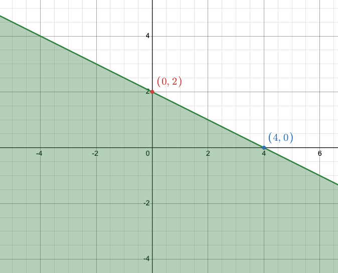

----
### References

Module 1 PDF

Gemini tools - [https://gemini.google.com/share/b3c0ec6c89db](https://gemini.google.com/share/b3c0ec6c89db)