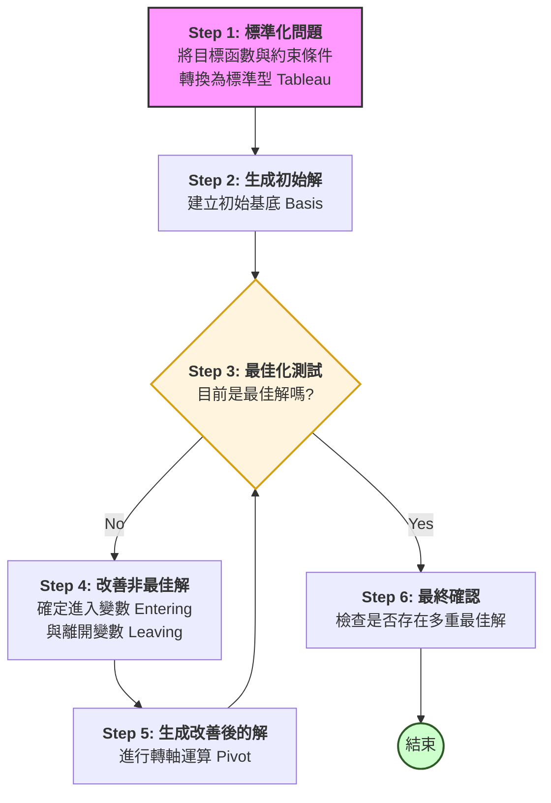
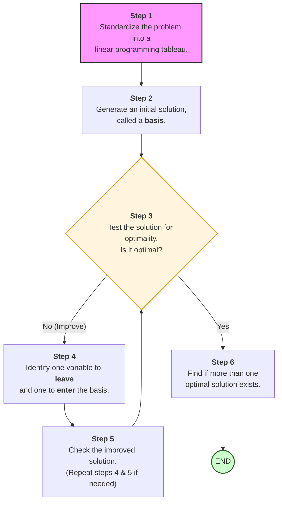

2026-02-23 08:10

Tags: #QuantitativeMethods 
Author:  Duke Hsu

---
# Module 4 - Simplex Method

## Concept 

- Developed by George Dantzig In 1946
- This method has proven to be remarkably efficient that it is used routinely to solve huge problems.
- Except for small problems
- This method is always executed on a computer.

### Assumptions for the simplex method
1. Maximization Problem
2. Equality  (=) Constraints
3. All variables are non-negative

### The simplex Process
Step 1 - Step 6

#### Step 1 
- Standardize the problem into a linear programming tableau . (Objective function and subject to )
#### Step 2
- Generate an initial solution, called a **basis**.

#### Step 3
- Test the solution for optimality . If the solution is not optimal, improve it (by going to step 4); otherwise go to step 6

### The improvement of a non-optimal solution is done in two steps (Repeat step)
#### Step 4 
- Generate an improved solution by identifying **one variable** that will leave the basis and one variable that will enter the **basis**.

#### Step 5
- The improved solution  is checked (see step 3) for optimality. If it is not optimal, then steps 4, and 5 are repeated. If is is optimal, step 6 is undertaken. 

#### Step 6 
- Find if more than one optimal solution exists.

### The simplex Process flow chart - Chinese

### The simplex Process

#### Example for Step 1  - Standardize the problem into a linear programming tableau 

- Convert the inequalities in the problem statement in to equations 

---

Handle  `<=` constraint , we need **Slack Variable**  positive S

Object function:

$Maximize \quad  Z = 300x_1 + 250x_2$

Subject to :

$2x_1 +x_2 \le 40 \qquad (labor)$

$x_1+3x_2 \le 45 \qquad (machine time)$

$x_1 \le 12 \qquad (marketing)$

$x_1,x_2 \ge 0$

labor constraint :

$2x_1 +x_2\le 40$

standard :

$2x_1+x_2+s_1=40$

machinetime constraint:

$x_1+3x_2 \le 45$

standard:

$x_1+3x_2+s_2 = 45$

marketing constraint:

$x_1 \le 12$

standard:

$x_1 + s_3 = 12$

Standard:

$Max \qquad Z = 300x_1 +250x_2 +0S_1+0S_2+0S_3$

$x_1,x_2,s_1,s_2,s_3 \ge 0$

----
Handle  `>=` constraint , we need **Surplus Variable**  negative  S  and add an  **Artificial Variable**  positive A

Object function:

$Minimize \quad  Z = 45x_1 + 12x_2$

Subject to :

$1x_1 +x_2 \ge 300 \qquad (brightness)$
$3x_1 \ge 250 \qquad (hue)$

brightness constraint :

$1x_1 +x_2 \ge 300$

standard :

$1x_1 +x_2 -s_1 +a_1 = 300$

hue constraint:

$3x_1  \ge 250$

standard:

$3x_1 -s_2 +a_2 = 250$

Standard:

$Min \qquad Z = 45x_1 +12x_2 +0S_1+0S_2 +Ma_1+Ma_2$

$x_1,x_2,s_1,s_2,a_1, a_2 \ge 0$

----
### References
