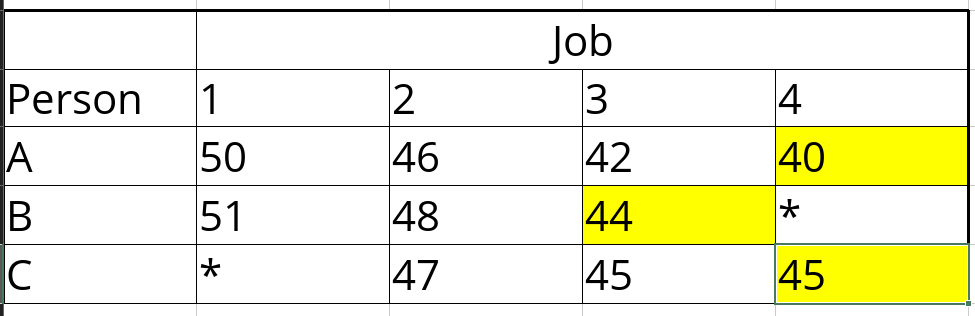
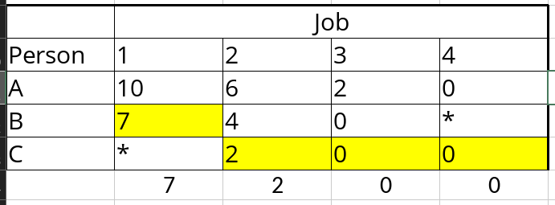
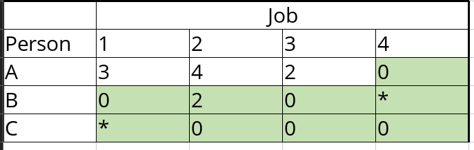
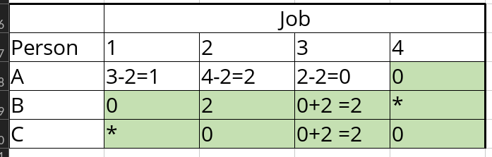
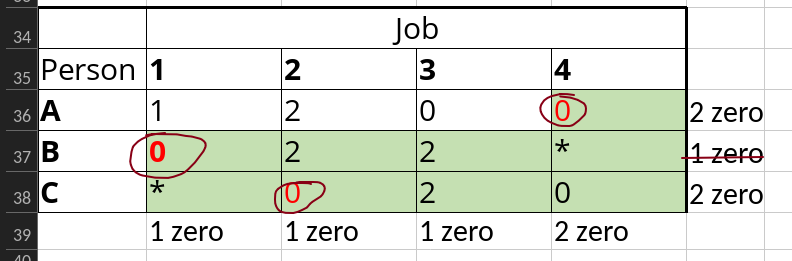
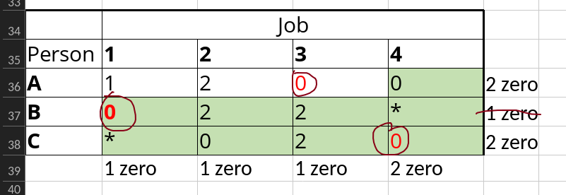

# Module 7 Assignment Model

2026-04-05 21:33

Tags: #math 

Author:  Duke Hsu

---

## The Hungarian Method

### Step 1 -  Row Reduction

Find minimum value in each ==row==. Subtract that value from each value in the same row .

**Table 0:**

In table 0 :
row A minimum value is `40`
row B minimum value is `44`
row C minimum value is` 45`

as for result 
A-1 = 50- 40 = 10
A- 2 = 46-40 = 6
A- 3 = 42- 40 = 2
A- 4 = 40- 40 = 0

B-1 = 51- 44 = 7
B-2 = 48- 44 = 4
B-3 = 44 -44 = 0

C-2 = 47 -45=2
C-3 = 45 -45=0
C-4 = 45 -45=0

### Step 2 - Column Reduction

Find minimum value in each ==column== . Subtract that value from each value in the same column.

**Table 1:**

 

Column 1 minimum value is `7`
column 2 minimum value is `2`
column 3 minimum value is `0`
column 4 minimum value is `0`

as for result 
A-1 = 10-7  = 3
A- 2 = 6-2 = 4
A- 3 = 2-0= 2
A- 4 = 0-0 = 0

B-1 = 7-7= 0
B-2 = 4-2 = 2
B-3 = 0-0= 0

C-2 = 2-2 = 0
C-3 = 0-0 = 0
C-4 = 0 - 0 = 0

### Step 3 - Cover All Zeros with Lines

Draw the ==minimum number of lines needed to cover all zeros==. If number of lines =  number of rows, you are done . Otherwise move to step 4 .

**Table cover all zeros with lines**

 

 

1 vertical line
2 horizontal lines

3 lines = number of rows

### Step 4 - Revise the Matrix

Find the smallest uncovered values. Subtract this from all uncovered values and add it to values at intersection of lines. Then repeat step 3. 

- Cells with **no line** through them: subtract the smallest uncovered number  
- Cells at the **crossing point** of two lines: add the smallest uncovered number  
- Cells with **exactly one line**: keep the number as it is

Uncovered value is 3, 4 , 2 . And the minimum value is 2 

 

### Step 5 - Circle the assignment from row or column with minimum number of zeros

Circle the assignment from row or column with minimum number of zeros. The final total cost will correspond to the original table values.

**The assignments:**
#### Case#1

 

Original cell

A-4 = 40
B-1 = 51
C-2 = 47 

**40+51+47 = 138**

---

#### Case#2:

 

Original cell

A-3 = 42
B-1 = 51
C-4 = 45 

**42+51+45 = 138**

### Rules

- Lines  =  Table number of rows
- These two assignments represent multiple optimal solutions for our example problem since the total distance traveled is the same for both cases.

----
## References

Module 7 PPT

Youtube - https://www.youtube.com/watch?v=qUUeZI2mKqE 
