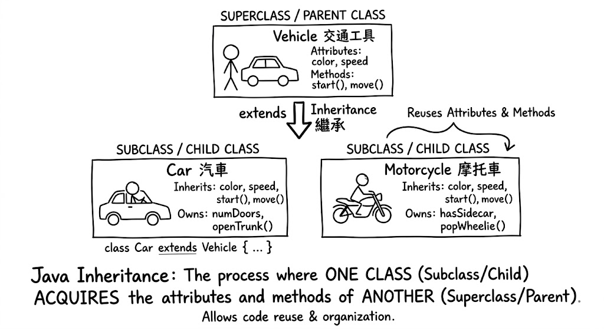

# Java Inheritance 

2026-03-29 11:15

Tags: #java 

Author:  Duke Hsu

---



## Key Concepts

- Inheritance is the process where one class acquires
- Acquires the  attributes and methods of another. 


## Real Life Code Example

**Main Class**

```java
/**
 * 
 */
package prjInteritance;

/**
 * Java Inheritance 
	2026-03-29 11:15
	Tags: #java 
	Author:  Duke Hsu
 */

public class Main {

	/**
	 * @param args
	 */
	public static void main(String[] args) {
		
		//create a object 
		Car car= new Car();
		
		
		//inheritance parent class attributes and method 
		car.start();
		car.brand= "Toyota";
		car.color = "Silver";
		car.speed = 120;
		System.out.println("Car details: \nBrand: "+ car.brand +" \nColor: "+ car.color+" \nSpeed: "+ car.speed);
		
		//sub class unique(owns) attributes  and method
		System.out.println();
		System.out.println("Sub class unique attributes:");
		
		System.out.println("Car door: " + car.numDoors);
		System.out.println();
		
		car.openTrunk();
		System.out.println();
		System.out.println();
		
		
		//***********************************//
		
		//create a object 
		Motorcycle honda = new Motorcycle();
		
		//inheritance parent class attributes and method
		honda.start();
		honda.brand = "Honda";
		honda.color = "Red";
		honda.speed = 60;
		System.out.println("Motorcycle details: \nBrand: "+ honda.brand +" \nColor: "+ honda.color+" \nSpeed: "+ honda.speed);
		
		//sub class owns attributes and method 
		System.out.println("*************************");
		System.out.println("Motorcycle PlateNum:  "+honda.plateNum);
		honda.popWheelie();
		
		
	}

}

```

**Parent Class**

Vehicle

```java
/**
 * 
 */
package prjInteritance;

/**
 * 
 */
public class Vehicle {
	
	//class vehicle attributes
	double speed;
	String color;
	String brand;
	
	
	//class vehicle methods
	void start() {
		
		System.out.println("This Vehicle is start!");
	}
	
	void move() {
		System.out.println("This Vehicle is move!~~");
	}
	
	void stop() {
		System.out.println("This Vehicle is stopped!~");
	}

}

```

**Sub class** 

Car and Motorcycle

```java
/**
 * 
 */
package prjInteritance;

/**
 * 
 */
//use extends keyword to inheritance parents class Vehicle 
//vehicle is parents class, car is sub class
public class Car extends Vehicle {
	
	//sub class unique attributes 
	int numDoors = 4;
	int car_wheel = 4; 
	
	void openTrunk() {
		
		System.out.println("The car trunk was opened!!");
	}

}

```

```java
/**
 * 
 */
package prjInteritance;

/**
 * 
 */

public class Motorcycle extends Vehicle {
	
	boolean hasSidecar = false;
	int plateNum = 22581;
	
	void popWheelie() {
		
		System.out.println("The motorcycle is doing a wheelie right now! haha that’s crazy!");
		
	}
}

```

**Output**

```
This Vehicle is start!

Car details:

Brand: Toyota

Color: Silver

Speed: 120.0

  

Sub class unique attributes:

Car door: 4

  

The car trunk was opened!!

  

  

This Vehicle is start!

Motorcycle details:

Brand: Honda

Color: Red

Speed: 60.0

*************************

Motorcycle PlateNum: 22581

The motorcycle is doing a wheelie right now! haha that’s crazy!

```

----
### References
