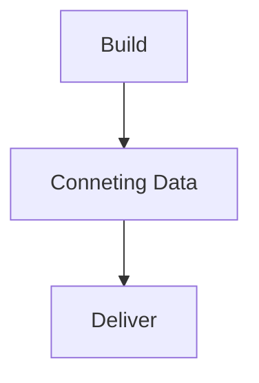
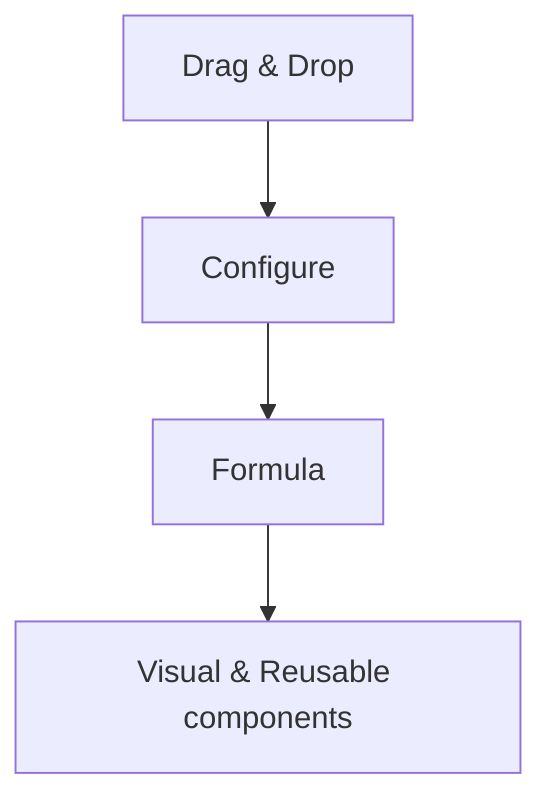

# Module - 3  Microsoft Power Apps with Canvas Apps

2026-08-20 12:49

Tags: #ADET 

Author:  Duke Hsu

---

# Topic 

1. Microsoft Power Apps
2. Canvas Apps in Microsoft Power Apps
3. Low-Code Development
4. Microsoft Power Platform
5. Canvas Apps and Model-Driven Apps
6. Power Apps with Data sources
7. Microsoft Dataverse
8. Power Fx

## Microsoft Power Apps

### 1.0 

- Low-code / No-Code Platforms
- Creating Application with power apps
- Connecting power apps to data sources

### 1.0 How it works 

Build more with visual design and less traditional programming

## 2.0 Low-Code advantages and disadvantages

| Advantages                       | Disadvantages           |
| -------------------------------- | ----------------------- |
| Faster Development               | Vendor Lock-in          |
| More people can build            | Limited Customization   |
| Easier Integration               | Scalability Limits      |
| Less Repetitive code             | Security and Governance |
| Connect existing systems         |                         |
| Prototype quickly                |                         |
| Collaborate with business user\s |                         |
| Low cost                         |                         |
| Better Visual Clarity            |                         |

## 3.0 Microsoft Power Platform

- Power Apps
- Power BI
- Power Automate
- Power Pages
- Copilot Studio
- Data Foundation / Dataverse 

## 4.0 Canvas Apps and Model-Driven Apps

### 4.1 Canvas Apps

- Full UI control 
- Support different data sources
- Better Visual Clarity 
- Mobile / Desktop Program

**Main components**

- Screens / Stages
- Controls
- Power Fx / function /函數
- Data Sources

### 4.2 Model-Driven Apps

- Dataverse-centered
- Forms, Views, Charts
- Structured processes / Data Processes and Analytics 
- SaaS  / Web application / Manager System

**Main components**

- Tables
- Forms
- Views
- Charts
Focus Business Application  /  Data Processes

Data , Relationships , Business Rules, Security , Access Control 

## 5.0 Power Apps Data Sources

You can connect the app to the existing data sources 

### 5.1 Existing Data Sources

- Excel
- SQL Server
- SharePoint
- Dataverse

CURD

- Create 
- Update
- Read
- Delete

### 5.2  Microsoft Dataverse

Microsoft Dataverse can store data, manage and process it, and provide the data for applications to display to users

- Tables
- Logical
- Relationship
- Security
- Power Platform Integration

----
## References

[https://learn.microsoft.com/en-us/power-apps/maker/data-platform/data-platform-intro](https://learn.microsoft.com/en-us/power-apps/maker/data-platform/data-platform-intro)

