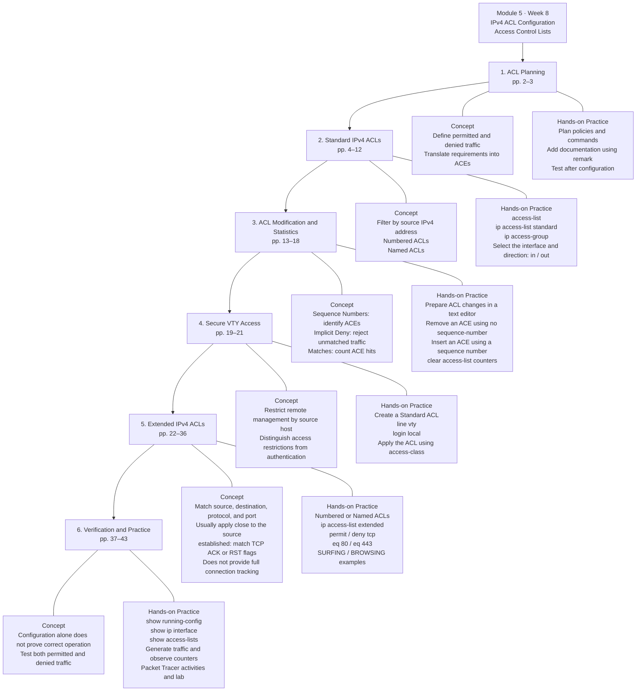

# Module - 5 ACLs For IPv4 Configuration

2026-09-29 17:15

Tags: #enterpriseNetwork 

Author:  Duke Hsu

---

## Topic

1. ACL Planning Concept 
2. Standard IPv4 ACLs Concept and Hands-on
3. ACL Modification and Statistics
4. Secure VTY Access and Hands-on
5. Extended IPv4 ACLs Concept and Hands-on
6. Verification and Practice





## 1. ACL Planning Concept and Hands-on

### 1.1 ACL Planning 

All access control lists (ACLs) must be planned. When configuring a complex ACL, it is suggested that you 

- Use a text editor and write out the specifics of the policy to be implemented.
- Add the IOS configuration commands to accomplish those tasks
- Include remarks to document the ACL
- Copy and pasts the commands onto the device
- Always thoroughly test and ACL to ensure that it correctly applies the desired policy

## 2. Standard IPv4 ACLs  and Hands-on

### 2.1 `access-list` command

**Syntax**

`R1(config)# access-list <access-list-number> {deny | permit | remark [text]} {host |source [source-wildcard]| any}`


### 2.2 Parameter table

!!! tip "Notes"
	Use the `no access-list <access-list-number>` global configuration command to remove a numbered standard ACL

| Parameter          | Description                                                                   |
| ------------------ | ----------------------------------------------------------------------------- |
| access-list-number | Number range is 1 to 99 or 1300 to 1999                                       |
| deny               | Denies access if the condition is matched                                     |
| permit             | Permits access if the condition is matched                                    |
| remark text        | Optional text entry for documentation purposes                                |
| source             | Identifies the source network or host address to filter                       |
| source-wildcard    | Optional 32-bit wildcard mask that is applied to the source                   |
| log                | Optional Generates and sends an informational message when the ACE is matched |


### 2.3  Named and Numbered Standard IPv4 ACL  

#### a. Command `ip access-list standard`

Use the `ip access-list standard` command to create a named standard ACL.

- ACL names are alphanumeric, case sensitive, and must be unique
- Capitalizing ACL names is not required but makes them stand out when viewing the `running-config` output

`R1(config)# ip access-list standard <access-list-name>`

Example:  

```
R1(config)#access-list 1 remark ALLOW-ACESS any
R1(config)#ip access-list standard ALLOW-ACESS
R1(config-std-nacl)#?
	<1-2147483647> Sequence Number
	
	default Set a command to its defaults
	
	deny Specify packets to reject
	
	exit Exit from access-list configuration mode
	
	no Negate a command or set its defaults
	
	permit Specify packets to forward
	
	remark Access list entry comment
```


Example 1:

```
R1#config t
R1(config)#ip access-list standard DENY-ACCESS
R1(config-std-nacl)#?

	<1-2147483647> Sequence Number
	default Set a command to its defaults
	deny Specify packets to reject
	exit Exit from access-list configuration mode
	no Negate a command or set its defaults
	permit Specify packets to forward
	remark Access list entry comment
	
	R1(config-std-nacl)#remark ACE DENY host 192.168.110.101
	R1(config-std-nacl)#deny host 192.168.110.101
	R1(config-std-nacl)#exit

R1(config)#interface serial 0/0/0
	R1(config-if)#ip access-group DENY-ACCESS out
	R1(config-if)#end
R1#
R1#show running-config | section access
	ip access-group DENY-ACCESS out
	ip access-list standard DENY-ACCESS
	remark ACE DENY host 192.168.110.101
	deny host 192.168.110.101

R1#
```


**Verify**


####  b. Numbered Standard ACL


 Example: 

Permit traffic from host 192.168.110.101  and 192.168.254.0/24 network out interface serial 0/0/0 on router R1 

**IOS command**

```
R1#config t
R1(config)#access-list 10 remark ACE permit ONLY host 192.168.110.101 to the internet
R1(config)#access-list 10 permit host 192.168.110.101

R1(config)#do show access-lists
	Standard IP access list 10
	10 permit host 192.168.110.101

R1(config)#access-list 10 remark ACE permit all host in LAN254
R1(config)#access-list 10 permit 192.168.254.0 0.0.0.255
R1(config)#do show access-lists
	Standard IP access list 10
	10 permit host 192.168.110.101
	20 permit 192.168.254.0 0.0.0.255

	R1(config)#interface serial 0/0/0
	R1(config-if)#ip access-group 10 out
	R1(config-if)#end


R1#show running-config | section access

	ip access-group 10 out
	access-list 10 remark ACE permit ONLY host 192.168.110.101 to the internet
	access-list 10 permit host 192.168.110.101
	access-list 10 remark ACE permit all host in LAN254
	access-list 10 permit 192.168.254.0 0.0.0.255

R1#show running-config

Building configuration...
version 15.1
no service timestamps log datetime msec
no service timestamps debug datetime msec
no service password-encryption


interface Serial0/0/0
ip address 172.168.10.9 255.255.255.252
ip access-group 10 out
clock rate 2000000

	access-list 10 remark ACE permit ONLY host 192.168.110.101 to the internet
	access-list 10 permit host 192.168.110.101
	access-list 10 remark ACE permit all host in LAN254
	access-list 10 permit 192.168.254.0 0.0.0.255

```


**Verify**


Figure -1  PC 110.101 -ACL tester


Figure -2  PC 110.102 -ACL tester


### 2.4 Apply a Standard IPv4 ACL

#### a. Command `ip access-group`

After a standard IPv4 ACL is configured , it  must be linked to an interface or feature

- The `ip access-group` command is used to bind a numbered or named standard IPv4 ACL to an interface. 
- To remove an ACL from an interface , first enter the  `no ip access-group` interface configuration command .

`R1(config-if)# ip access-group <access-list-number | access-list-name> {in | out}`

Example: 

```
R1(config)#interface gigabitEthernet 0/0
R1(config-if)#ip access-group 1 in
R1(config-if)#end

R1#show running-config | section access-group
	ip access-group 1 in

R1#show running-config | section access
	ip access-group 1 in
	access-list 1 remark ALLOW-ACESS any
	ip access-list standard ALLOW-ACESS
```


## 3. ACL Modification and Statistics

After an ACL is configured , it may need to be modified. ACLs with multiple ACEs can be complex to configure. Sometimes the configured ACE does not yield the expected behaviors. 

Two methods to use when modifying an ACL:

- Use a text editor
- Use sequence numbers


### 3.1 Text Editor Method

ACLs with multiple ACEs should be created in a text editor. This allows you to plan the required ACEs, create the ACL, and then paste it into the router interface. It also simplifies the tasks to edit and fix an ACL. 

To correct an error in an ACL:

- **Step 1**  Copy the ACL from the running configuration and paste it into the text editor.
- **Step 2**  Make the necessary edits or changes. 
- **Step 3** Remove the perviously configured ACL on the router. 
- **Step 4** Copy and paste the edited ACL back to the router. 

### 3.2 Sequence Number Method

An ACL ACE can be deleted or added using the ACL sequence numbers. 

- Use the `ip access-list standard` command to edit an ACL
- Statements cannot be overwritten using an existing sequence number
- The current statement must be deleted first with the  `no 10`  command .
- Then the correct ACE can be added using sequence number.

#### 3.2.1 Modify 

Example:  

```

R1(config)#ip access-list standard DENY-ACCESS
R1(config-std-nacl)#?

	<1-2147483647> Sequence Number
	default Set a command to its defaults
	deny Specify packets to reject
	exit Exit from access-list configuration mode
	no Negate a command or set its defaults
	permit Specify packets to forward
	remark Access list entry comment

R1(config-std-nacl)#no 10
R1(config-std-nacl)#10 permit host 192.168.110.101
R1(config-std-nacl)#remark ACE Permit host 192.168.110.101 - by duke
R1(config-std-nacl)#end

R1#show ip access-lists
	Standard IP access list DENY-ACCESS
	10 permit host 192.168.110.101
	Standard IP access list PERMIT-ACCESS
	10 permit host 192.168.110.102 (6 match(es))
	
R1#config t
R1(config)#interface serial 0/0/0
R1(config-if)#ip access-group 10 out
R1(config-if)#end


R1#show running-config | section access-list
	ip access-list standard DENY-ACCESS
	remark ACE DENY host 192.168.110.101
	permit host 192.168.110.101
	remark ACE Permit host 192.168.110.101 - by duke
	ip access-list standard PERMIT-ACCESS
	remark ACE PERMIT host 192.168.110.102
	permit host 192.168.110.102

```

#### 3.2.2 Append

Example：

```
R1#config t

R1(config)#ip access-list standard 1
R1(config-std-nacl)#?

	<1-2147483647> Sequence Number
	default Set a command to its defaults
	deny Specify packets to reject
	exit Exit from access-list configuration mode
	no Negate a command or set its defaults
	permit Specify packets to forward
	remark Access list entry comment

R1(config-std-nacl)#15 deny ?

	A.B.C.D Address to match
	any Any source host
	host A single host address

R1(config-std-nacl)#15 deny host 192.168.110.103
R1(config-std-nacl)#end


R1#show access-lists

	Standard IP access list DENY-ACCESS
	10 permit host 192.168.110.101
	Standard IP access list PERMIT-ACCESS
	10 permit host 192.168.110.102 (6 match(es))
	Standard IP access list 1
	15 deny host 192.168.110.103
	
```


### 3.3 ACL Statistics

The `show access-lists` command in the example shows statistics for each statement that has been matched

-  Matches 
- Note that the implied deny any statement does not display any statistic
- To track how many implicit denied packets have been matched, you must manually configure the deny any command. 
- Use the `clear access-list counters <access-list-nam>` to clear the ACL statistics.

Example: 

```
R1#show ip access-lists
	Standard IP access list DENY-ACCESS
	10 permit host 192.168.110.101
	Standard IP access list PERMIT-ACCESS
	10 permit host 192.168.110.102 (6 match(es))
	Standard IP access list 1
	15 deny host 192.168.110.103 (3 match(es))


R1#clear ?

	aaa Clear AAA values
	access-list Clear access list statistical information
	arp-cache Clear the entire ARP cache
	cdp Reset cdp information
	frame-relay Clear Frame Relay information
	ip IP
	ipv6 IPv6
	line Reset a terminal line
	mac-address-table MAC forwarding table
	vtp Clear VTP items


R1#clear access-list counters 1

R1#show ip access-lists
	Standard IP access list DENY-ACCESS
	10 permit host 192.168.110.101
	Standard IP access list PERMIT-ACCESS
	10 permit host 192.168.110.102 (6 match(es))
	Standard IP access list 1
	15 deny host 192.168.110.103
	
	
```


## 4. Secure VTY Access

A standard ACL can secure remote administrative access to a device using the VTY lines by implementing the following two steps:

- Create an ACL to identify which administrative hosts should be allowed remote access. 
- Apply the ACL to incoming traffic on the VTY lines.

`R1(config-line)# access-class <access-list-number | access-list-name> {in | out}`

### 4.1  Secure VTY Access Step by Step 

#### Step 1 - Set  username and password

 `R1(config)# username <user-name> secret <pass-word>` 

#### Step 2 - Set access-list standard  Host

`R1(config)# ip access-list standard <access-list-name>`

#### Step 3 - Set ACL details 

```
R1(config-std-nacl)# remark <remark-content>
R1(config-std-nacl)# permit <host-ip-address>
R1(config-std-nacl)# deny any 
R1(config-std-nacl)# exit
```

#### Step 4 - Set VTY 

```
R1(config)# line vty <number>  <number> //example line vty 0 4
R1(config-line)# login local
R1(config-line)# transport input telnet
R1(config-line)# access-class <acess-list-name> in
R1(config-line)# end
```


Example: 

```
R1#config t
R1(config)#username duke secret 12345

R1(config)#ip access-list standard ADMIN-PC
	R1(config-std-nacl)#remark Only Admin-PC allow access this router
	R1(config-std-nacl)#permit 192.168.254.101
	R1(config-std-nacl)#deny any
	R1(config-std-nacl)#exit
	
R1(config)#line
R1(config)#line vty 0 4

R1(config-line)#login local
R1(config-line)#transport input telnet
R1(config-line)#access-class ADMIN-PC ?

	in Filter incoming connections
	out Filter outgoing connections

R1(config-line)#access-class ADMIN-PC in
R1(config-line)#exit
R1(config)#enable secret admin //開啟特權模式
R1(config)#end

R1#


R1#show running-config | section line

	line con 0
	line aux 0
	line vty 0 4
	access-class ADMIN-PC in
	login local
	transport input telnet

R1#show access-lists
	Standard IP access list ADMIN-PC
	10 permit host 192.168.254.101
	20 deny any
	
```

**Verify**


----
## References

[https://www.cisco.com/c/en/us/support/docs/security/ios-firewall/23602-confaccesslists.html](https://www.cisco.com/c/en/us/support/docs/security/ios-firewall/23602-confaccesslists.html) 


