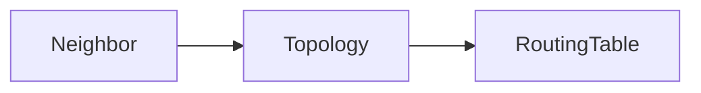
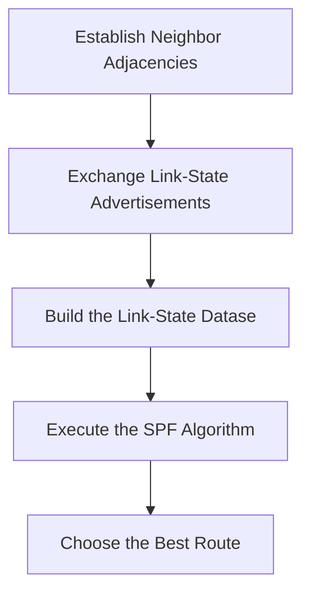

# Module 1  Single  Area  Open  Shortest  Path First

2026-08-18 16:58
Update: 2026-08-26 

Tags: #enterpriseNetwork 

Author:  Duke Hsu

---

## Topic 

1. OSPF Features and Characteristics
2. Components of OSPF 
3. Three OSPF Databases
4. SPF Algorithm
5. Link-State Operation
6. Single-Area and Multi-Area  OSPF
7. OSPF Operational States
8. Hello Packet
9. DR / BDR / DROTHER
10. OSPF Cost Calculation

## 1.0 OSPF Features and Characteristics

OSPF - Open Shortest Path First

### 1.1 Core concept

- OSPF is a Link-State Routing Protocol
- OSPF has faster convergence than RIP
- OSPF is more scalable
- OSPF user **areas**
- Link-State information includes:
	- Network Prefix
	- Prefix Length
	- Cost

OSPF learns the network topology and calculates the shortest path.

## 2.0 Components of OSPF

OSPF routers exchange routing information with each other through OSPF messages.

OSPF has five packet types:

| Type | Packet name                      | Description                                                | Memorize       |
| ---- | -------------------------------- | ---------------------------------------------------------- | -------------- |
| 1    | Hello                            | Discovers neighbors and builds adjacencies between them    | find other     |
| 2    | Database Description(DBD)        | Checks for database synchronization between routers        | informed other |
| 3    | Link-State Request(LSR)          | Requests specific link-state records from router to router | ask status     |
| 4    | Link-State Update(LSU)           | Sends specifically requested link-state records            | reply  status  |
| 5    | Link-State Acknowledgment(LSAck) | Acknowledges the other packet types                        | noted          |

## 3.0 Three OSPF Databases

| Database                  | Table          | Command                 |     |
| ------------------------- | -------------- | ----------------------- | --- |
| Adjacency Database        | Neighbor table | `show ip ospf neighbor` |     |
| Link-State Database(LSDB) | Topology Table | `show ip ospf database` |     |
| Forwarding Database       | Routing Table  | `show ip route`         |     |

## 4.0 SPF Algorithm 

### OSPF Path Selection

OSPF uses the **Dijkstra Shortest Path First (SPF) Algorithm** to calculate the best path.

OSPF uses **Cumulative Cost** to compare different paths.

**Lower Cost = Better Path**

Example:

Path A: R1 → R2 → R4
Cost:      10 + 10 = 20

Path B: R1 → R3 → R4
Cost:      5  + 10 = 15

**Path B → Cost 15** ✅

## 5.0 Link-State Operation 

## 6.0 Single-Area and Multiarea OSPF 

### 6.1 Single-Area OSPF

All routers are in the same OSPF area.

Usually, we use **Area 0**.

Example:

R1 ─── R2 ─── R3
     Area 0

### 6.2 Multiarea OSPF

There are multiple OSPF areas.

All other areas must connect to the **Backbone Area (Area 0)**.

A router that connects Area 0 to another area is called an:

**ABR = Area Border Router**

Example:

Area 1                              Area 0                               Area 2
  R1 ─── [ABR] ─── R2 ─── [ABR] ─── R3

## 7.0 OSPF Operational States

Down → Init → Two-Way → ExStart → Exchange → Loading → Full

|State|中文理解|
|---|---|
|Down|還沒收到 Hello|
|Init|收到對方 Hello|
|Two-Way|雙方已經互相認識|
|ExStart|決定誰先開始交換 DBD|
|Exchange|交換 DBD|
|Loading|用 LSR / LSU 補齊資訊|
|Full|LSDB 完全同步|

## 8.0 Hello Packet

# Hello Packet

The default OSPFv2 Hello interval on multiaccess and point-to-point networks is 10 seconds, while the default Dead interval is 40 seconds.

The OSPF Hello Packet has several important functions:

- **Discover Neighbors**
  - Discover other OSPF routers.

- **Establish Adjacency**
  - Establish and maintain OSPF neighbor relationships.

- **Advertise Parameters**
  - Exchange parameters required to become OSPF neighbors.

- **Elect DR and BDR**
  - Elect a **Designated Router (DR)** and **Backup Designated Router (BDR)** on multiaccess networks.

## Point-to-Point Links

Point-to-point links **do not require DR/BDR election**.

## OSPFv2 Hello Multicast Address

OSPFv2 Hello packets use the following IPv4 multicast address:

**224.0.0.5 = AllSPFRouters (All OSPF Routers)**

----
## Class note

- Use LEC module to in LAB  / This week
- 

----
## References

