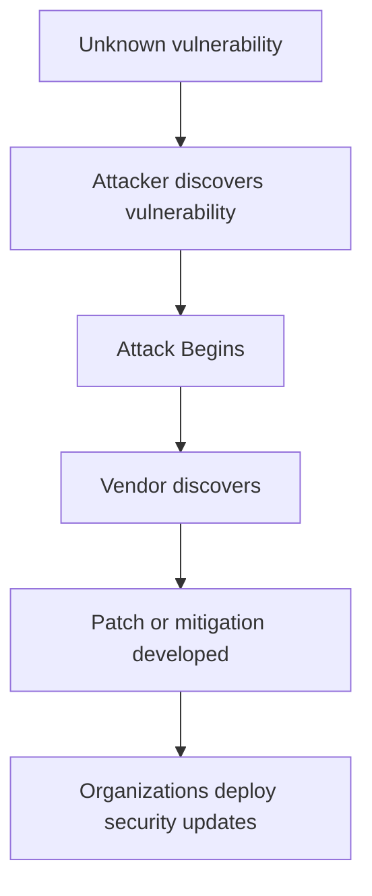

# Module 2B - Threats , Vulnerabilities, Exploits, and Common Attack Vectors

2026-08-18 11:32

Tags:  #IAS 

Author:  Duke Hsu

---

# Topic 

1. Threats  
2. Vulnerability  
3. Exploits  
4. Threat Actors  
5. Attack Surfaces
6. Common Attack Vectors 

!!! tip "Tips"
	Vulnerability 是「洞」，Exploit 是「鑽洞的動作」，Threat 是「想鑽洞的人」，Security Weakness 是「沒把洞補起來的管理疏失」。

- **Threat（威脅）**:有意圖造成傷害的人或行為(駭客、攻擊者、釣魚郵件本身是攻擊手法)
- **Vulnerability（弱點）**:系統/軟體本身存在的技術性漏洞或缺陷
- **Exploit（利用）**:實際「動手」去利用某個弱點的行為/程式
- **Security Weakness（安全弱點/做法上的不足）**:偏向管理面、設定面、使用習慣上的疏失(不是技術漏洞本身,而是防護措施沒做好)

**判斷小技巧(可以寫在筆記或直接用來檢查答案):**

1. 句子裡如果出現「攻擊者主動想做壞事」的意圖 → **Threat**
2. 句子裡如果是「系統/軟體本身有問題」，是一個「狀態」→ **Vulnerability**
3. 句子裡如果出現「利用、使用...來達成攻擊」的**動作**，代表漏洞已經被實際觸發 → **Exploit**
4. 句子裡如果是「使用者習慣不好」或「該做的防護沒做」，屬於管理/操作層面的疏失 → **Security Weakness**

## 1.0 Threats   - 威脅

- A threat is any potential event, action, circumstance, or person that can cause harm to an information system, network, device, organization or its users, A threat does not necessarily mean that an attack has already occurred. It represents the possibility of harm. 

**Examples of Threats**

- Malware infection   
- Phishing 
- Ransomware
- Insider attacks  
- Data theft 
- Denial-of-Service attacks    - DDOS
- Natural disasters
- Hardware failure
- Unauthorized access
- Social engineering
- Cyber espionage 

| Type                 | Description                                | Example                              |
| -------------------- | ------------------------------------------ | ------------------------------------ |
| External Threat      | Comes from outside the organization        | Hacker attempting to breach a server |
| Internal Threat      | Comes from someone inside the organization | Employee stealing confidential files |
| Intentional Threat   | Deliberately causes harm                   | Ransomware attack                    |
| Unintentional Threat | Accidentally causes harm                   | Employee deleting important files    |
| Natural Threat       | Caused by environmental events             | Flood or earth quake                 |
| Technical Threat     | Results from technology failures           | Server failure                       |

## 2.0. Vulnerabilities - 漏洞

A vulnerabilities is a weakness or flaw in a system that could be exploited by a threat actor. 

- Software 
- Hardware
- Networks
- Applications
- Operating Systems
- Configurations
- Security policies
- Human behavior
- Physical facilities

Threat vs Vulnerability 

- Threat: Cybercriminal - 
- Vulnerabilities: Outdated web server
- Attack: Attempt to exploit the flaw 
- Impact: Unauthorized access or data theft

## 3.0 Exploit  - 漏洞利用

An exploit is a technique, code , tool, or procedure used to take advantage of a vulnerability 

In simple terms: A vulnerability is the weakness, an exploit is the method used to take advantage of that weakness

- The relationship is: Vulnerability > Exploit > Attack  > Impact

Common Exploitation Techniques 

- SQL injection
- Buffer overflow
- Command injection
- Cross-site scripting
- Privilege escalation
- Authentication bypass
- Remote code execution
- Exploitation of misconfigured sevices

Exploit Tools 

- Nmap
- Wireshark
- Metaslpoit
- Burp Suite
- OpenVAS / Greenbone
- Nessus

## 4.0 Threat Actors  - 威脅行為者

A threat actor is an individual , group, organization , or entity that intentionally or unintentionally creates a cybersecurity threat. 

Common Threat Actors

1. Cybercriminals - 
2. Nation-State Actors - North Korean
3. Hacktivists 
4. Script Kiddies
5. Cyberterrorists
6. Insider Threats - Disgruntled employee

##  5.0 Attack Surface 

An attack surface is the collection of all possible points where an attacker could attempt  to gain unauthorized access to an organization's systems or information 

Can represent a potential security exposure. In cybersecurity , these become attack surfaces. 

### 5.1 Types of  Attack Surface

Network 

- Routers, Switches, Firewalls, Access Point, Open ports , Servers

Application 

- Websites, APIs, Mobile Applications, Web Applications, Database Interfaces

Endpoint

- Desktop PC, Laptops, Smart phone, Tablets, IoT devices

Human 

- Employees, Students, Administrators, Contractors, Customers. 

Cloud 

- Cloud storage
- Virtual machines
- IAM
- Misconfigured cloud services 

## 6.0  Security Weaknesses 

Types of  Security Weaknesses 

**Physical Weaknesses**

- Unlocked server room
- Unsecured network equipment
- Lack of CCTV
- Unprotected backup media

**Human Weaknesses**

- Weak passwords
- Password sharing
- Clicking suspicious links
- Poor security awareness
- Social engineering susceptibility 

**Security Weakness vs Vulnerability**

- Security Weakness: Broad condition that reduces security 
- Vulnerability: A specific weakness that can potentially be exploited

## 7.0 Zero-Day Vulnerabilities

A zero-day vulnerability is a previously unknown  or unpatched security vulnerability for which 
defenders have had little or no time to develop and deploy and effective fix .  The term "Zero-day". refers to the face that defenders effectively have had zero days of warning or preparation . 

## 8.0 Common Attack Vectors

An attack vector is the method or pathway an attacker users to gain access to a system or cause harm . 

Think of it as: "How does the attacker get in??"

- Phishing  
- Malware
- Weak or Stolen Credentials
- Unpatched Software
- Social Engineering
- Melicious Websites
- Removable Media
- Wireless Attacks
- DDoS (Denial-of-Service)

----
## References

WEEK 2- PPT